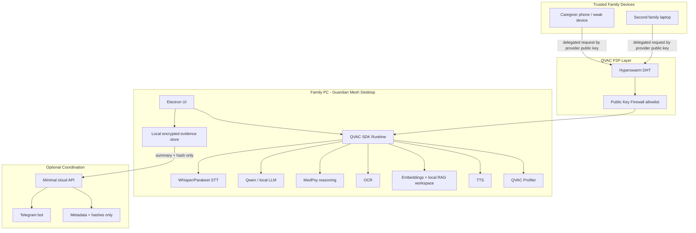

# FINAL GLOBAL WINNING PLAN

**Project reviewed:** KINKEEPER  
**Date:** 2026-06-21  
**Mission:** maximize probability of becoming a top-ranked QVAC submission, with no sunk-cost protection.

---

## 1. Executive Summary

Brutal verdict: **KINKEEPER should not continue in its current form.**

The current product is a cloud-shaped web dashboard with local QVAC attached through a tunnel. That is not fatal, but it is strategically weaker than the best QVAC-native submissions. The manual upload workflow is low-frequency, hard to demo under pressure, easy for judges to classify as "just an app calling a local model," and fragile in production because the Render API depends on a local node reachable through `QVAC_NODE_URL`.

The strongest path is not abandoning the emotional domain. Elder/family protection is still powerful. The correct move is to **replace the current product shape** with a QVAC-native product:

> **Guardian Mesh:** a local-first family fraud and safety firewall that runs on the family's devices, detects scam calls, phishing documents, dangerous payment/signing prompts, and cognitive-risk patterns locally, then alerts trusted caregivers through an explainable, hash-linked evidence flow.

This is not "KINKEEPER plus features." It is a rebuild of the core narrative and architecture:

- From manual uploads to continuous local protection.
- From web dashboard to desktop-first local appliance.
- From Render-centric orchestration to QVAC-owned local runtime.
- From elder-care dashboard to family safety firewall.
- From one or two models to a coherent QVAC capability stack: Whisper/Parakeet, Qwen, MedPsy, OCR, embeddings/RAG, TTS, profiler, local storage, and optional delegated inference with Public Key Firewall.

Recommended architecture: **Electron desktop-first local appliance with optional cloud coordination.**

Recommended hackathon posture:

- Do not claim production maturity.
- Do not claim medical diagnosis.
- Do not make cloud the hero.
- Do not chase every competitor.
- Win by showing a private, local, emotional protection loop that judges understand in 20 seconds.

Estimated winning probability:

- Current KINKEEPER web/dashboard: **8-15%**
- Current KINKEEPER with tunnel fixed and good demo: **25-35%**
- Guardian Mesh desktop-first rebuild with local OCR + voice + RAG + TTS + evidence: **50-65%**
- Guardian Mesh with trusted-device delegation/firewall proven live: **60-75%**

---

## 2. Competitor Ranking

Evidence rule: projects with repos, demos, DoraHacks pages, downloadable builds, or explicit technical artifacts outrank social-only claims. Social-only projects are not dismissed, but their score is capped by evidence quality.

| Rank | Project | Score | Adoption potential | Real-world value | Defensibility | Win probability | Key reason |
|---:|---|---:|---:|---:|---:|---:|---|
| 1 | SignSafe | 9.3 | High | High | High | Very high | Clear danger moment, local signing-risk explanation, offline mobile demo, prompt-injection resistance |
| 2 | TaleTrip | 9.0 | Medium-high | Medium | Medium | High | Broad QVAC showcase: story, image, vision, RAG, TTS, P2P, family emotional demo |
| 3 | MedLifeSim | 8.9 | Medium | High | Medium-high | High | MedPsy-first visual simulation, strong "not a chatbot" positioning, local medical privacy |
| 4 | Conduit | 8.7 | Medium | High | High if real | High | Pure QVAC thesis: P2P inference market, DHT, payments, firewall; execution risk is high |
| 5 | Edgency | 8.5 | High | High | Medium | High | Offline emergency assistant on mobile with RAG, tools, voice, multimodal story |
| 6 | Stellar Field | 8.1 | Medium | Medium | Medium | Medium-high | Offline astronomy assistant demonstrates voice, vision, RAG, TTS, tool calls on-device |
| 7 | MindSafe | 8.0 | Medium-high | High | Medium | Medium-high | Voice-in/voice-out mental wellness, MedPsy, RAG, OCR, TTS, strong privacy narrative |
| 8 | PayGuard | 7.8 | High | High | Medium-high | Medium-high | OCR + RAG + LLM + TTS for payment safety; clear financial risk moment |
| 9 | Stash.ai | 7.5 | Medium | Medium | Medium | Medium | Self-hosted second brain; useful but less emotionally urgent |
| 10 | Orova / HeySolana | 7.4 | Medium-high | Medium | Medium | Medium | Voice wallet is demoable; OpenAI/cloud ambiguity weakens QVAC purity |
| 11 | KINKEEPER current | 7.0 fixed / 4.5 live-broken | Medium | High | Medium | Low-medium | Strong problem, weak current workflow and cloud-shaped architecture |
| 12 | Diamesh | 7.0 | Medium | High | Medium | Medium | Eye-care clinical multi-agent pipeline, MedPsy + vision + RAG + P2P claims |
| 13 | Everclaw | 6.8 | Medium | Medium | Medium | Medium | Electron local Web3 agent OS; strong local pattern, crowded crypto-agent space |
| 14 | MindMirror | 6.7 | Medium | Medium-high | Low-medium | Medium | Local journal RAG and analytics; overlaps MindSafe |
| 15 | KaleidoMind | 6.4 | Medium | Medium | Medium | Low-medium | Voice wallet/RAG/BTC layers; artifact evidence limited |
| 16 | Survival Co-pilot | 6.3 | Medium | High | Low-medium | Low-medium | Great offline survival angle; public evidence limited |
| 17 | Leash / Mycelium | 6.2 | Medium | Medium | Medium | Low-medium | Local personal agent/fine-tuning story; demo risk high |
| 18 | Vakeel | 6.1 | High | High | Medium | Low-medium | Offline legal assistant has real value; legal correctness risk is high |
| 19 | PAYO | 6.0 | High | High | Medium | Low-medium | Offline merchant payments are valuable; QVAC depth less proven |
| 20 | AuditPi | 5.8 | Low-medium | Medium | Medium | Low | Raspberry Pi auditor is memorable, but smart-contract audit market is narrow |
| 21 | Chimera | 5.7 | Medium | Medium | Medium | Low | Inference-task routing/rewards idea is interesting but diffuse |
| 22 | ZendPay | 5.6 | High | High | Medium | Low | Payments infra idea is large; QVAC evidence remains less concrete |
| 23 | Fibiom | 5.4 | Unknown | Unknown | Low-medium | Low | Holepunch/WDK/Electron experimentation, limited product clarity |
| 24 | Godot MCP agent | 5.2 | Medium | Low-medium | Low | Low | Technically fun but less aligned with QVAC privacy stakes |
| 25 | Voice Yoto / kid audio control | 5.0 | Medium | Medium | Low | Low | Nice local privacy use case, but too narrow for top rank |

KINKEEPER's honest rank: **outside the top 10 in current form**. It can move above PayGuard/MindSafe/Edgency only if it becomes visibly QVAC-native, continuous, local, and multimodal.

---

## 3. Winner Pattern Analysis

Judges repeatedly reward:

1. **A private moment with obvious harm.** Signing a malicious transaction, sharing health data, recording a child's voice, being scammed, needing help offline.
2. **A product that only makes sense locally.** If cloud AI would be equally acceptable, the submission is weaker.
3. **Broad but coherent QVAC usage.** Not random feature stuffing, but a chain where each model has a job.
4. **On-device proof.** Airplane mode, local terminal, profiler output, hardware specs, model names, no API keys.
5. **A simple before/after demo.** Before: user is exposed. After: local AI blocks/explains/protects.
6. **Autonomy with explanation.** The agent acts or alerts, but shows why.
7. **Artifact credibility.** Hashes, exports, logs, evidence packets, reports, screenshots, reproducible commands.
8. **Platform fit.** Desktop/mobile/local appliance beats cloud dashboard for QVAC.
9. **Human emotion.** Kids, elders, mental health, medical scenarios, money safety, emergency survival.
10. **Technical humility.** Strong projects disclose limitations and prove the path that works.

Judges tend to ignore:

1. Generic dashboards.
2. "AI assistant" without a concrete risk moment.
3. Cloud architecture with local inference bolted on.
4. Token metrics without product meaning.
5. Long onboarding flows.
6. Broad roadmaps without a live local demo.
7. Features that could be implemented with OpenAI.
8. Claims about P2P/delegation without a visible provider public key and consumer flow.
9. Medical or legal overclaims.
10. Crypto complexity unless it is essential to the user story.

Most common strong QVAC features:

- Local LLM/Qwen-style reasoning.
- Whisper or other local STT.
- Embeddings/RAG.
- TTS.
- OCR.
- Mobile or desktop local runtime.
- Profiler/hardware evidence.

Underused opportunities:

- Public Key Firewall as trusted-family-device allowlist.
- Profiler as judge-facing proof, not just debugging.
- Cancellation/suspend/resume as real product controls for low-power devices.
- Local RAG workspaces as persistent memory, not just document search.
- Voice assistant loop with explainable evidence artifacts.
- Blind relays and DHT as a family/private network primitive.
- Parakeet diarization/end-of-utterance for multi-speaker scam calls.

Hidden winning combination:

> Local voice scam detection + OCR document/payment risk + family RAG memory + TTS caregiver briefing + tamper-evident evidence + delegated inference to trusted home node protected by Public Key Firewall.

No competitor in the provided list owns that exact combination.

---

## 4. KINKEEPER Failure Analysis

Why KINKEEPER might fail:

1. **Manual upload is weak.** Real caregivers will not regularly upload recordings. Scams happen in live channels: phone calls, messages, invoices, links, wallet prompts.
2. **The workflow is low-frequency.** Baseline scans and occasional uploads do not create daily engagement.
3. **The dashboard is not the product.** Caregivers need a timely warning, not a complex portal.
4. **The demo can look staged.** Uploading a sample WAV into a web app feels like a classifier demo, not a living safety system.
5. **The architecture is fragile.** Vercel + Render + Supabase + local QVAC via tunnel creates many failure points and weakens local-first purity.
6. **Current QVAC usage is not broad enough.** Whisper/Qwen/MedPsy are good, but competitors are showing OCR, RAG, TTS, vision, mobile, P2P, and profiler evidence.
7. **"Cognitive drift" is risky.** Judges may worry about medical overclaiming, false positives, and family anxiety.
8. **Family setup is heavy.** Hackathon judges do not want to watch account setup, family creation, elder creation, and Telegram linking before the core wow moment.
9. **Security risk is real.** Family isolation is app-layer; no visible RLS hardening. Secrets appeared in local env paste artifacts. Raw audio/cloud handling needs a much stronger boundary.
10. **The story is split.** Scam detection, cognitive drift, family dashboard, evidence chain, Telegram, QVAC health, and cloud deployment all compete for attention.

Why judges might ignore it:

- It looks like a SaaS dashboard.
- The QVAC node can be unhealthy in production.
- It does not visibly prove local-first unless the presenter explains the tunnel.
- It lacks an instant "I understand why this wins" moment.
- It competes with emotionally strong health/mental/kids projects and technically strong security/payment projects.

Why users might not use it:

- Elders will not initiate scans.
- Caregivers are busy and will not maintain local tunnels.
- Family members may distrust cognitive monitoring.
- Telegram alerts without continuous sensing may arrive too late.
- Manual setup creates abandonment.

Why competitors outperform it:

- SignSafe has a sharper danger moment.
- PayGuard uses more QVAC modalities in one coherent flow.
- MindSafe has stronger voice-in/voice-out privacy.
- MedLifeSim makes MedPsy visual and interactive.
- TaleTrip makes QVAC breadth obvious.
- Conduit makes P2P the product, not an optional footnote.

Current KINKEEPER should be **transformed**, not polished.

---

## 5. Alternative Concepts

| # | Concept | Problem | Users | Why users care | Why QVAC required | Adoption path | Revenue | Demo quality | Judge appeal | Feasibility |
|---:|---|---|---|---|---|---|---|---|---|---|
| 1 | Guardian Mesh | Families face scams across calls, docs, payments, and messages | Elders, caregivers, families | Prevents money loss and panic | Sensitive voice/docs stay local; P2P trusted-device compute | Desktop app + Telegram/mobile companion | Family subscription, insurer/bank partnerships | Very high | Very high | High |
| 2 | Offline Emergency Medic | Help when no signal or crisis | Travelers, rural users, families | Immediate guidance offline | MedPsy + RAG + voice local | Mobile app | Consumer + NGO/government | Very high | High | Medium |
| 3 | Private Mental Health Companion | Journals and voice therapy are sensitive | Individuals | Privacy and daily support | MedPsy, RAG, TTS local | Mobile/desktop | Subscription | High | High | Medium |
| 4 | SignSafe Plus | Stop malicious signing/payment | Crypto users | Prevents direct money loss | Payload analysis without leaking wallet intent | Browser/mobile wallet plugin | Wallet partnerships | Very high | Very high | Medium |
| 5 | Local Legal Shield | Contracts/rental docs hide risk | Tenants, freelancers, immigrants | Avoids costly mistakes | OCR/RAG over legal docs locally | Desktop/mobile document scanner | Freemium/legal affiliates | High | Medium-high | Medium |
| 6 | Clinic-in-a-Box | Small clinics need private AI intake | Clinics | Keeps patient data local | MedPsy/OCR/RAG/voice local | Desktop appliance | B2B license | High | High | Medium-low |
| 7 | Offline Learning Tutor | Kids need safe local tutoring | Parents, schools | No cloud exposure for children | Voice, RAG, TTS, local curriculum | Tablet app | Schools/parents | High | Medium | Medium |
| 8 | Disaster Mesh Assistant | Disasters break internet | Families, responders | Offline triage, coordination | P2P, voice, RAG, local maps | Mobile + local node | Public safety/NGO | High | High | Medium-low |
| 9 | Personal Data Vault Agent | People need local search over life files | Knowledge workers | Private second brain | Embeddings/RAG/local LLM | Desktop app | Subscription | Medium | Medium | High |
| 10 | AI Browser Scam Firewall | Phishing/scripts/scams in browser | Everyone | Prevents common web harm | Local script/URL/page analysis | Browser extension + local QVAC | Consumer/security | High | High | Medium |
| 11 | Elder Cognitive Diary | Detect change from passive voice/journal | Families, clinicians | Early signals without cloud | MedPsy, STT, RAG local | Desktop/mobile | Family/clinical | Medium-high | Medium-high | Medium |
| 12 | Local Agent Workbench | Let users run private agents | Developers/power users | No API bills/privacy | QVAC core SDK showcase | Desktop | Pro license | Medium | Medium | High |

Best alternative: **Guardian Mesh**.

It keeps the strongest emotional part of KINKEEPER but destroys the weak manual dashboard workflow.

---

## 6. Final Chosen Concept

**Guardian Mesh: the local-first family fraud and safety firewall.**

One-line pitch:

> Guardian Mesh runs on your family's own devices to detect scam calls, phishing documents, dangerous payment prompts, and cognitive-risk conversations locally, then alerts trusted caregivers with explainable, hash-linked evidence.

Core promise:

- Voice never needs to leave the home.
- Documents never need to leave the device.
- Family context stays in local RAG memory.
- AI decisions are explainable and auditable.
- Trusted caregivers receive only minimal alert summaries and hashes.
- Stronger devices can provide inference to weaker devices through QVAC delegated inference and a Public Key Firewall.

This should replace current KINKEEPER positioning.

Keep from KINKEEPER only if useful:

- Elder/family empathy.
- Telegram caregiver alerts.
- Evidence chain concept.
- Existing QVAC model experience.
- Some backend code as optional coordination.

Discard as primary product:

- Web-first dashboard.
- Manual upload as main workflow.
- Render as inference orchestrator.
- Complex onboarding.
- Technical health pages as user-facing core.

---

## 7. Why It Beats All Alternatives

Guardian Mesh beats current KINKEEPER because:

- It turns a low-frequency upload tool into continuous protection.
- It makes QVAC mandatory and visible.
- It creates multiple demo inputs: voice call, phishing letter, payment request, caregiver alert.
- It avoids medical diagnosis while preserving elder-safety emotion.
- It can be useful for families even without clinical claims.

Guardian Mesh beats SignSafe by expanding beyond crypto signing into real family fraud channels.

Guardian Mesh beats PayGuard by covering voice scams and family escalation, not just invoices/payments.

Guardian Mesh beats MindSafe by focusing on immediate external threats and family action, not only self-reflection.

Guardian Mesh beats MedLifeSim by being closer to everyday family harm and easier to demo in one minute.

Guardian Mesh beats TaleTrip on urgency, though TaleTrip may still beat it on QVAC breadth unless Guardian Mesh shows OCR/RAG/TTS/P2P live.

Guardian Mesh beats Conduit for user clarity. Conduit is technically purer P2P, but a family scam firewall is easier for judges to emotionally understand.

---

## 8. Complete Product Vision

Guardian Mesh is a local safety layer for families.

### Personas

1. **Elder:** receives calls, letters, texts, and payment requests. Does not manage technology.
2. **Caregiver:** wants timely alerts and simple next steps.
3. **Trusted family operator:** installs the local desktop hub and configures trusted devices.
4. **Judge/demo viewer:** needs proof that AI is local, private, useful, and QVAC-native.

### Protected inputs

- Phone-call audio recordings or live mic simulation.
- Voicemail files.
- Screenshots of SMS/WhatsApp/email scams.
- PDF/image invoices and letters.
- Payment/signing prompts.
- Short voice check-ins for cognitive-risk signals.

### Outputs

- Plain-language risk verdict: Safe / Suspicious / Block.
- Why it is suspicious.
- What to do next.
- Evidence hash.
- Caregiver Telegram alert.
- Optional TTS spoken warning.
- Local evidence packet.
- Judge proof panel with profiler output.

### Product principles

- Local first, cloud last.
- Alert before dashboard.
- Evidence before trust.
- Explain before action.
- No diagnosis.
- No raw audio in cloud.
- No AI claims without profiler/evidence.

---

## 9. Complete Architecture

Recommended option: **Option C: Electron desktop-first local appliance.**

Electron wins because it uses the existing TypeScript/Node/QVAC skillset, supports Windows demo quickly, can own local files/models, and looks QVAC-native enough for judges. Native Windows is not worth the extra engineering cost. Mobile-first is attractive but too risky. Fully local appliance is pure but harder for caregiver notifications. Hybrid local/cloud is useful, but desktop must be the product center.

### Architecture

### Option comparison

| Option | Judge score | Adoption | Cost | QVAC alignment | Scale | Demo quality | Decision |
|---|---:|---:|---:|---:|---:|---:|---|
| A. Current Vercel + Render + Supabase + Local QVAC | 5 | 6 | 3 | 4 | 7 | 5 | Reject as core |
| B. Desktop-first | 9 | 7 | 6 | 9 | 6 | 9 | Accept |
| C. Electron | 9 | 7 | 5 | 9 | 6 | 9 | **Choose** |
| D. Native Windows app | 8 | 6 | 9 | 8 | 5 | 8 | Reject for time |
| E. Mobile-first | 9 | 8 | 9 | 9 | 8 | 8 | Defer |
| F. Fully local appliance | 10 | 5 | 7 | 10 | 4 | 8 | Too narrow now |
| G. Hybrid local/cloud | 8 | 8 | 6 | 7 | 8 | 8 | Use as support, not core |

---

## 10. QVAC Feature Mapping

| Capability | Use? | Value created | Judge reaction | Score impact |
|---|---|---|---|---|
| Whisper / Parakeet | Yes | Transcribes scam calls and voice check-ins locally; Parakeet can add diarization/streaming | Strong, obvious privacy use | Very high |
| MedPsy | Yes, carefully | Caregiver-risk reasoning, stress/cognitive signal explanation, not diagnosis | Strong if framed safely | High |
| Qwen / local LLM | Yes | Fast scam/phishing classification and explanation | Expected but necessary | High |
| OCR | Yes | Reads scam letters, invoices, payment screenshots | Makes product broader and more demoable | High |
| Vision | Optional | Screenshots or visual fraud cues | Good but not necessary | Medium |
| Embeddings | Yes | Local semantic memory and trusted contact/pattern retrieval | Strong QVAC depth | High |
| RAG | Yes | Grounds decisions in elder context, known contacts, prior incidents, scam playbooks | Strong if visible | Very high |
| TTS | Yes | Spoken "do not pay, call your daughter" warning and caregiver briefing | High emotional demo value | High |
| Delegation | Yes, as bonus | Weak device delegates to trusted home PC | Strong QVAC-native proof | High if reliable |
| Public Key Firewall | Yes, with delegation | Only trusted family devices can use home provider | Strong security story | High if shown |
| Hyperswarm | Yes, indirectly | Direct provider-public-key P2P connection | Technical judge signal | Medium-high |
| P2P inference | Yes, demo if stable | Family device mesh, not cloud | Strong differentiator | High |
| Local storage | Yes | Raw evidence stays on device | Required for privacy claim | Very high |
| Offline operation | Yes | Core scans work with internet disabled; Telegram waits until online | Strongest QVAC signal | Very high |
| Profiler | Yes | Proves model load/inference/delegation timing | Judges love proof | High |
| Cancellation/suspend | Nice-to-have | Practical local app control | Shows maturity | Medium |
| OpenAI-compatible server | No for demo | Could integrate later, but weakens clarity | Neutral | Low |
| Diffusion/image generation | No | Not needed for fraud/safety | Feature bloat | Negative |
| Video generation | No | Not relevant | Feature bloat | Negative |
| BCI/VLA | No | Not relevant | Distracting | Negative |

---

## 11. Security Model

Security thesis:

> Sensitive inputs stay local; remote parties receive only minimized summaries, hashes, and explicit user-approved exports.

Controls:

1. **Local raw data boundary:** audio, images, PDFs, transcripts, and RAG memory are stored locally by default.
2. **Cloud minimization:** cloud receives only alert summary, severity, timestamp, evidence hash, and caregiver routing data.
3. **Evidence hash chain:** each incident packet includes model versions, input hashes, decision hash, and previous packet hash.
4. **Trusted device allowlist:** delegated inference provider uses Public Key Firewall with known consumer public keys.
5. **No dynamic provider marketplace:** QVAC docs indicate delegation connects directly by provider public key; avoid claiming generic discovery.
6. **Offline mode:** core classification works without internet; Telegram queues or is disabled until online.
7. **No medical diagnosis:** MedPsy output is framed as "caregiver signal" and "recommend human follow-up."
8. **No persistent cloud audio:** any uploaded demo file must be ephemeral, but final architecture removes cloud raw audio entirely.
9. **Profiler evidence:** judge proof panel shows local hardware and timings.
10. **Secret hygiene:** no env paste files in repo; rotate exposed secrets.

Threats:

- False positives creating family panic.
- False negatives missing scams.
- Caregiver overreliance.
- Unauthorized family member access.
- Malicious prompt injection in call transcript or document.
- P2P provider abuse if firewall is misconfigured.
- Cloud metadata leakage.

Mitigations:

- Risk categories are conservative.
- Every alert includes "call trusted caregiver before acting."
- Prompt-injection tests are included in demo evidence.
- Provider public keys are explicit and reproducible.
- Firewall allowlist is shown live.
- Cloud data model excludes raw sensitive inputs.

---

## 12. User Journey

### Install

1. Family operator installs Guardian Mesh desktop on the home PC.
2. App downloads/loads QVAC models.
3. App creates local encrypted evidence store.
4. App pairs caregiver Telegram.
5. App optionally shows provider public key for trusted device delegation.

### Everyday use

1. Elder receives suspicious call, letter, invoice, or payment request.
2. Elder or caregiver drops the file/screenshot/audio into Guardian Mesh, or the desktop monitors a local folder.
3. QVAC runs local STT/OCR.
4. Local RAG retrieves trusted contacts, prior scam patterns, known family context.
5. Qwen/MedPsy classify and explain risk.
6. TTS speaks a plain-language warning.
7. Evidence packet is sealed.
8. Caregiver receives Telegram summary and evidence hash.
9. Caregiver acknowledges or escalates.

### Caregiver experience

Caregiver does not need to understand QVAC, hashes, or models. They see:

- "Margaret may be on a scam call."
- "The caller asked for gift cards and claimed to be the IRS."
- "Do not pay. Call Margaret now."
- "Evidence hash: verified."
- "Acknowledge / Call / View proof."

---

## 13. Demo Journey

Five-minute winning demo:

1. **0:00 - Stakes.** "My mother receives a fake bank call. I cannot send her voice to a cloud LLM."
2. **0:20 - Airplane/local proof.** Show desktop app, local QVAC runtime, model list, profiler enabled.
3. **0:45 - Voice scam.** Drop in or record a scam-call audio. Whisper/Parakeet transcribes locally.
4. **1:30 - RAG context.** Show retrieved local memory: trusted bank phone number, known family contacts, prior scam pattern.
5. **2:00 - Local reasoning.** Qwen/MedPsy produces verdict: Block / suspicious, with plain explanation.
6. **2:40 - TTS warning.** App speaks: "Do not send money. Call your caregiver."
7. **3:10 - Evidence.** Show evidence packet, input hash, model versions, decision hash, chain valid.
8. **3:45 - Telegram.** Caregiver receives alert with summary and hash, taps acknowledge.
9. **4:15 - OCR second proof.** Drop a fake invoice/screenshot; OCR extracts text and flags payment risk locally.
10. **4:45 - P2P bonus.** If stable, phone/second laptop delegates to the home PC provider public key with firewall allowlist.
11. **5:00 - Close.** "The cloud coordinates family response. It does not see the voice, documents, or reasoning memory."

Fallback if P2P fails:

- Do not demo delegation live.
- Show provider public key, firewall config, and recorded evidence clip.
- Keep core demo local and reliable.

---

## 14. Judge Journey

What the judge understands immediately:

1. Elder scams are real and emotionally urgent.
2. Cloud AI is unacceptable for private family voice and financial documents.
3. QVAC is not a sidecar; it is the runtime that makes the product possible.
4. Multiple QVAC capabilities are used coherently.
5. The product works offline/local first.
6. The output is explainable and auditable.
7. Telegram makes the action loop real.
8. P2P/firewall show advanced QVAC depth without making the product confusing.

Judge talking points:

- "This is not a dashboard. It is a local family safety firewall."
- "The sensitive data stays on the family machine."
- "QVAC handles speech, OCR, local memory, reasoning, and speech output."
- "The caregiver gets only a minimized alert and evidence hash."
- "A weaker family device can delegate to a trusted home node using QVAC provider public keys."

What not to show:

- Long account setup.
- Render/Vercel deployment complexity.
- Supabase table details.
- Raw env/config.
- Unhealthy QVAC node.
- Medical-diagnosis language.

---

## 15. Build Roadmap

### Phase 1: Minimum winning rebuild

1. Create Electron desktop shell.
2. Run QVAC SDK directly inside local runtime boundary.
3. Implement local incident pipeline:
   - audio input,
   - OCR image/PDF input,
   - RAG retrieval,
   - risk classifier,
   - evidence packet,
   - TTS warning.
4. Keep Telegram cloud bot only for alert summaries.
5. Add judge proof panel:
   - local models,
   - hardware,
   - profiler timings,
   - evidence chain status.

### Phase 2: QVAC-native depth

1. Add trusted device delegation.
2. Add provider public key display.
3. Add Public Key Firewall allowlist.
4. Add offline queue for Telegram alerts.
5. Add prompt-injection and adversarial transcript tests.

### Phase 3: Product polish

1. Replace technical dashboard with three tabs:
   - Protect,
   - Evidence,
   - Trusted Devices.
2. Add caregiver-friendly language.
3. Add "what to do now" scripts.
4. Package Windows build.
5. Record final demo.

---

## 16. Risk Analysis

| Risk | Severity | Reality | Mitigation |
|---|---|---|---|
| Rebuild too large for deadline | Critical | Likely | Build only local incident demo, not full app |
| Electron + QVAC integration problems | High | Possible | Keep CLI/local Node fallback demo |
| P2P delegation flaky | High | Likely on cold DHT | Treat as bonus, not core path |
| OCR model setup delay | Medium | Possible | Use one known test image and preload models |
| TTS latency | Medium | Possible | Preload and cache generated warning |
| Medical overclaiming | High | Controllable | Say caregiver signal, not diagnosis |
| False positive concern | Medium | Controllable | Use "review/block" language and human follow-up |
| Telegram dependency | Medium | Existing risk | Demo local alert UI even if Telegram fails |
| Secret exposure | High | Existing risk | Rotate secrets and remove paste artifacts |
| Judges prefer existing complete app | Medium | Possible | Position rebuild as focused hackathon artifact |

---

## 17. Adoption Analysis

Who adopts first:

1. Adult children caring for aging parents.
2. Families with prior scam exposure.
3. Crypto/payment users who already fear signing scams.
4. Privacy-conscious households.
5. Small elder-care organizations.

Why they adopt:

- Immediate fear: "My parent might send money to a scammer."
- Privacy: "I do not want family voice recordings in cloud AI."
- Simplicity: "Telegram tells me when to act."
- Trust: "I can see why the alert fired."

Why they churn:

- Too much setup.
- Too many false positives.
- Local model downloads are too heavy.
- Elder refuses monitoring.
- Caregiver receives noisy alerts.

Revenue potential:

- Family subscription: $8-15/month for sync/alerts/support.
- One-time local appliance license.
- Partnerships with banks, insurers, elder-care agencies.
- Premium fraud-pattern packs.
- Enterprise elder-care deployment.

Defensibility:

- Local family context RAG improves over time.
- Evidence-chain archive creates trust history.
- Trusted-device mesh is hard to replicate with pure cloud AI.
- Domain-specific scam/caregiver workflows create product moat.

---

## 18. Long-Term Potential

Guardian Mesh can become a broader local safety layer:

- Scam-call protection.
- Phishing document review.
- Payment/signing prompt review.
- Caregiver alerting.
- Elder cognitive-risk signals.
- Offline emergency guidance.
- Browser/email/plugin integrations.
- Bank/insurer safety partnerships.
- Trusted family compute mesh.

Long-term product category:

> A local AI safety firewall for families.

This is larger than KINKEEPER and more defensible than a dashboard.

---

## 19. Exact Steps To Build

### Immediate code steps

1. Keep existing repo, but create the new product path around a desktop/local runtime.
2. Add `apps/guardian-desktop` or convert a minimal Electron shell.
3. Use current QVAC package knowledge but avoid Render in the inference path.
4. Add local input directory:
   - `samples/scam-call.wav`,
   - `samples/fake-bank-invoice.png`,
   - `samples/payment-request.txt`.
5. Add local RAG seed:
   - trusted contacts,
   - bank phone numbers,
   - known scam patterns,
   - caregiver instructions.
6. Add local incident pipeline:
   - `transcribe()` for audio,
   - `ocr()` for images,
   - `ragSearch()` for context,
   - `completion()` for verdict,
   - `textToSpeech()` for spoken warning,
   - evidence packet writer.
7. Add profiler export for every step.
8. Add evidence chain verification.
9. Add Telegram notification using summary/hash only.
10. Add one "Trusted Devices" proof screen:
    - provider public key,
    - consumer public key,
    - firewall allowlist,
    - delegation status.

### What to reuse

- Existing QVAC model loading patterns.
- Existing Telegram service concepts.
- Existing evidence-chain ideas.
- Existing web UI components only if they speed up Electron.

### What not to reuse

- Render as inference orchestrator.
- Manual-upload dashboard as core product.
- Family onboarding flow as demo path.
- Technical health pages as user-facing story.

---

## 20. Exact Steps To Demo

Pre-demo setup:

1. Start Guardian Mesh desktop.
2. Preload STT, OCR, embeddings, LLM/MedPsy, and TTS models.
3. Enable profiler.
4. Pair Telegram.
5. Prepare fake bank scam call and fake invoice.
6. Prepare local RAG memory.
7. If using P2P, start provider and copy public key.

Live demo:

1. Show app in local/offline-ready mode.
2. Show no OpenAI/cloud API keys.
3. Run scam-call audio.
4. Show transcript.
5. Show retrieved RAG context.
6. Show verdict and explanation.
7. Play TTS warning.
8. Show evidence packet and hash chain.
9. Show Telegram alert.
10. Run OCR invoice scan.
11. Show profiler timings.
12. Optional: run delegated inference from trusted device.

Backup:

- If Telegram fails, show local alert queue.
- If OCR fails, continue with voice scam.
- If P2P fails, show provider/firewall config and recorded clip.
- If TTS is slow, play cached generated warning and disclose it was generated locally before the demo.

---

## 21. Exact Steps To Win

1. **Stop selling KINKEEPER as a web dashboard.**
2. **Rename/reframe the submission as Guardian Mesh or "KINKEEPER Guardian Mesh."**
3. **Lead with the elder scam moment, not architecture.**
4. **Show local QVAC before any cloud route.**
5. **Use at least four QVAC capabilities live:** STT, OCR, RAG/embeddings, LLM/MedPsy, TTS.
6. **Use profiler output as proof.**
7. **Use evidence chain as trust layer.**
8. **Use Telegram as action layer.**
9. **Use delegation/firewall only if it is reliable.**
10. **Delete or hide anything that makes the product look cloud-first.**
11. **Never show broken health checks.**
12. **Never require judges to understand Render, Vercel, or Supabase.**
13. **Never claim diagnosis.**
14. **Make the closing sentence unforgettable:**

> "Guardian Mesh is a private AI safety firewall for families: the cloud can notify, but only the family's own devices are allowed to think."

Final recommendation:

**Do not abandon the family-protection domain. Abandon current KINKEEPER as a manual-upload cloud dashboard. Rebuild it into Guardian Mesh, a desktop-first local QVAC safety firewall with optional trusted-device delegation.**

