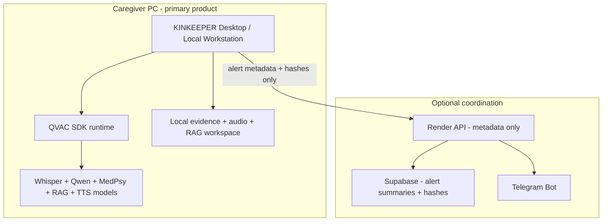
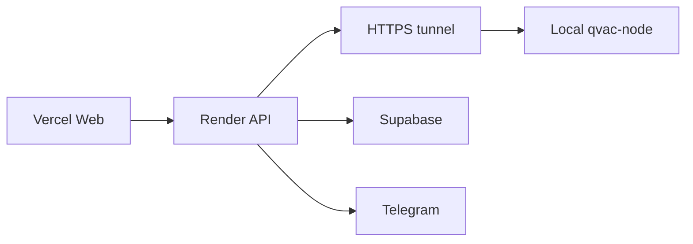

# FINAL MASTER PLAN

**Project:** KINKEEPER  
**Date:** 2026-06-20  
**Mission:** Maximize probability of winning the current QVAC Hackathon.  
**Verdict:** Do not defend the current architecture. Convert the story and, if time permits, the product surface toward a QVAC-first local caregiver workstation with optional cloud coordination.

---

## 1. Executive Summary

KINKEEPER has a strong product idea but a weaker-than-ideal QVAC presentation.

The strongest competitors are not just using QVAC as a backend inference endpoint. They are packaging the product as **local-first desktop or mobile apps** where privacy is obvious: SignSafe, TaleTrip, MedLifeSim, Conduit, Edgency, MindSafe, PayGuard, and Everclaw.

KINKEEPER's current deployed architecture is:

- Vercel frontend
- Render API and workers
- Supabase Postgres
- Upstash Redis
- Telegram bot
- local QVAC node accessed through `QVAC_NODE_URL`

This can be valid if presented as **cloud coordination, local cognition**, but it is not the objectively strongest QVAC-native architecture. The best winning path is:

1. Keep the family/elder safety thesis.
2. Keep Telegram autonomy.
3. Keep the evidence chain.
4. Move the core demo toward a local-first caregiver workstation.
5. Add QVAC RAG and TTS if time allows.
6. Use cloud only for coordination, not inference.

---

## 2. Current Ranking

Estimated position among reviewed projects:

| Rank band | Projects | Notes |
|---|---|---|
| Top tier | SignSafe, TaleTrip, MedLifeSim, Conduit, Edgency, Stellar Field, MindSafe, PayGuard | More QVAC-native, local-first, broader capability usage |
| Competitive tier | Stash.ai, Orova, **KINKEEPER**, Diamesh, Everclaw, MindMirror, KaleidoMind | Strong concepts; outcome depends on demo completeness |
| Lower-evidence tier | PAYO, AuditPi, Vakeel, Leash, MindMirror, Chimera, Survival Co-pilot, ZendPay, Fibiom, Stash | Potentially strong but less evidence available |

KINKEEPER current score:

- **Current live production:** 4.5 / 10 because QVAC is unhealthy unless fixed.
- **After QVAC tunnel + live upload + Telegram:** 7.5 / 10.
- **After local-first framing + RAG/TTS + polished demo:** 8.2 / 10.
- **With desktop local workstation:** 8.8 / 10.

---

## 3. Competitor Ranking

Evidence weighting: repos/DoraHacks/evidence bundles outrank social-only claims. Video-heavy sources that could not be fully inspected are treated as limited evidence, not assumed functionality.

| Rank | Project | Evidence level | Judge score | Why it ranks here |
|---:|---|---|---:|---|
| 1 | SignSafe | DoraHacks + GitHub + iOS repo + demo | 9.3 | Deterministic local signing-risk engine, QVAC RAG/Qwen/GTE, tool-calling, prompt-injection resistance, mobile offline claim |
| 2 | TaleTrip | DoraHacks + repo + evidence bundle | 9.0 | iPad + Mac P2P workflow, six modalities, RAG, TTS, MedPsy, SDXL, strong family/privacy story |
| 3 | MedLifeSim | Website + DoraHacks/release evidence | 8.9 | MedPsy-first desktop medical simulation canvas, P2P, translation, LoRA/export story |
| 4 | Conduit | Website + X/submission evidence | 8.7 | Serverless P2P inference market with WDK payments and QVAC delegation/firewall thesis |
| 5 | Edgency | DoraHacks + demo/architecture | 8.5 | Offline mobile emergency assistant: MedPsy, Gemma multimodal, GTE RAG, Whisper, SQLite, tools |
| 6 | Stellar Field | X + partial repo/search evidence | 8.1 | Android offline astronomy assistant with voice, vision, RAG, TTS, tool calls |
| 7 | MindSafe | GitHub + demo + performance logs | 8.0 | Offline mental wellness: MedPsy, Whisper Large, TTS, EmbeddingGemma, OCR, RAG, crisis flow |
| 8 | PayGuard | GitHub README + demo + deck | 7.8 | OCR/RAG/LLM/TTS + Solana escrow; strong local desktop safety layer |
| 9 | Stash.ai | DoraHacks + website + GitHub | 7.5 | Self-hosted second brain with local QVAC Ask mode; QVAC mapping less differentiated |
| 10 | Orova / HeySolana | DoraHacks + Play Store + demo + GitHub metadata | 7.4 | Voice-first Solana wallet with local/delegated inference claim; OpenAI messaging weakens local story |
| 11 | **KINKEEPER** | Repo + live deploy + local evidence | **7.4 now / 8.2 fixed** | Strong elder-safety problem and evidence chain; weaker local-first packaging and production QVAC fragility |
| 12 | Diamesh | X evidence | 7.0 | Multi-agent eye-care clinical intelligence with MedPsy, SmolVLM, RAG, P2P claims |
| 13 | Everclaw | GitHub + demo | 6.8 | Electron Web3 agent OS with Qwen + WDK; strong local app pattern |
| 14 | MindMirror | X/search evidence | 6.7 | Local journal RAG and analytics on 8GB laptop; overlaps MindSafe |
| 15 | KaleidoMind | X evidence | 6.4 | Voice wallet, RAG, BTC layers, L402; direct artifact evidence limited |
| 16 | Survival Co-pilot | DoraHacks + limited video metadata | 6.3 | Off-grid survival story; insufficient inspectable evidence |
| 17 | Leash / Mycelium | X evidence | 6.2 | Desktop local agent/fine-tuning narrative; public repo evidence unclear |
| 18 | Vakeel | X evidence | 6.1 | Offline legal assistant with document extraction and verification agent |
| 19 | PAYO | X evidence | 6.0 | Offline micro-merchant payments; QVAC details less proven |
| 20 | AuditPi | X evidence | 5.8 | Raspberry Pi smart-contract auditor; good hardware story, RAG planned |

KINKEEPER honestly ranks outside the top 10 unless the live demo proves local QVAC, Telegram, and evidence chain end-to-end. With tunnel fixed, RAG/TTS evidence, and a desktop/local-first narrative, KINKEEPER can move into the 6-8 range.

Main competitive lessons:

1. SignSafe proves deterministic guardrails, prompt-injection resistance, and reproducibility can outrank raw feature count.
2. TaleTrip proves P2P/offloading plus multimodal breadth is a major judge signal.
3. MedLifeSim proves MedPsy + visual workflow can win attention.
4. Conduit proves P2P/delegation/firewall/payment-gated inference is a high-upside QVAC-native thesis, even if execution is risky.
5. Edgency proves mobile + RAG + tool calling + role-specific system prompts can beat web dashboards.
6. MindSafe proves voice-in / voice-out mental-health workflows are highly judgeable.
7. PayGuard proves broad QVAC use wins: OCR + RAG + LLM + TTS + local SQLite + payment safety.

KINKEEPER should not copy trading, wallet, or child storybook features. It should copy:

- local-first packaging,
- evidence bundles,
- TTS artifacts,
- QVAC RAG,
- deterministic guardrails,
- explicit hardware/performance logs.

---

## 4. Project Weaknesses

### Architecture

- Web/cloud-first surface weakens QVAC local-first perception.
- `QVAC_NODE_URL` tunnel model is fragile.
- Production was misconfigured with `localhost`, proving the architecture is easy to break.
- Uploaded audio originally lived on Render, while QVAC inference lived locally; this required base64 transfer to be valid.

### QVAC depth

- No QVAC RAG in product.
- No QVAC TTS.
- No QVAC OCR.
- No QVAC vision.
- Delegation is scripts-only, not user-facing.
- No Public Key Firewall in product.

### UX

- Dashboard exposes TTFT/TPS and hashes in caregiver-facing screens.
- Health page explains little when QVAC is offline.
- Timeline and Alerts overlap.
- Caregiver persona needs simpler language.

### Security

- Supabase has no Postgres RLS; family isolation is application-layer.
- Render env paste file contains severe secrets and must be rotated.
- Evidence files on Render `/tmp` are ephemeral.
- Telegram links and evidence links should be carefully scoped.

### Demo readiness

- Production upload path only works if local QVAC + tunnel is healthy.
- Public proof must be populated.
- Telegram ack must be shown live.

---

## 5. Project Strengths

1. **Clear real-world painkiller:** elders are targeted by scams and caregivers need timely signals.
2. **Two-agent safety model:** Sentinel for scams, Cognoscente for cognitive drift.
3. **MedPsy relevance:** Cognoscente is a natural Psy-track story.
4. **Autonomous caregiver workflow:** detect -> explain -> archive -> notify.
5. **Telegram-first operations:** aligns with winner patterns from Auric and other agent projects.
6. **Evidence chain:** stronger auditability than many local-only apps.
7. **Public proof concept:** strong if populated and honest.
8. **Family workspace:** multi-user care workflow is more realistic than solo chatbot.

---

## 6. Product Positioning

### Chosen identity

**Elder Protection Agent**

Reject these alternatives:

- **Family Safety OS:** too broad and sounds like a platform before the product is proven.
- **AI Caregiver Copilot:** too generic and too close to chatbot positioning.
- **Scam Prevention Network:** too narrow; loses Cognoscente and MedPsy.
- **Cognitive Decline Early Warning System:** too medical and legally risky.

The strongest identity is:

> KINKEEPER is a local-first Elder Protection Agent that detects scam calls and cognitive drift on family hardware, seals every decision into tamper-evident evidence, and alerts caregivers on Telegram before harm happens.

This identity wins because it immediately answers:

- why this matters: elders lose money and independence;
- why AI is required: voice/call/cognitive patterns are hard for static rules;
- why QVAC is required: voice and cognitive data are too sensitive for cloud LLMs;
- why Telegram matters: caregivers need alerts where they already are;
- why evidence matters: families need trust, not black-box AI.

---

## 7. Critical Architecture Questions

| Question | Decision | Evidence / rationale |
|---|---|---|
| Is Web + Render + Vercel correct? | **Not as final architecture.** Keep only as demo/coordination. | Top competitors are local desktop/mobile. Web/cloud weakens QVAC local-first perception. |
| Web app, desktop app, or hybrid? | **Hybrid now, desktop-first next.** | Current web is useful for demo, but strongest QVAC posture is local workstation. |
| Should local QVAC become mandatory? | **Yes.** | QVAC rules and docs center local/BYOH inference. Cloud inference would undercut the submission. |
| Should cloud components be reduced? | **Yes.** | Cloud should coordinate auth/Telegram/metadata, not hold raw audio or inference. |
| Highest-scoring QVAC architecture? | **Desktop local caregiver workstation + optional cloud sync.** | Matches PayGuard/MindSafe/MedLifeSim local-first pattern while preserving KINKEEPER’s Telegram/evidence advantages. |
| Highest-scoring caregiver architecture? | **Hybrid.** | Caregivers need phone alerts; family setup can be cloud-assisted, but sensitive inference must be local. |
| What beats strongest competitors? | **Narrower but deeper story:** elder scam + cognitive drift + Telegram + hash evidence + local MedPsy. | Do not chase TaleTrip multimodal breadth or Conduit marketplace complexity. |

---

## 8. Recommended Architecture

### Final recommendation

**Desktop-first local caregiver workstation + optional cloud coordination.**

If there is no time to build Electron packaging, use the current web architecture but demo it as a transitional implementation:

---

## 9. Exact QVAC Features To Use

### Must use

1. **Whisper / STT** for Sentinel and Cognoscente audio.
2. **Qwen** for fast scam classification.
3. **MedPsy** for cognitive and caregiver-risk reasoning.
4. **Profiler/logging** for TTFT, TPS, hardware, backend device.
5. **RAG / embeddings** for elder baseline memory and caregiver notes.
6. **TTS** for spoken alert artifacts and accessibility.

### Optional but high value

1. **Delegated inference** for a two-device demo.
2. **Public Key Firewall** only if delegation is shown.
3. **OCR** for scam letter / invoice / medical-document evidence intake.

### Defer

1. Vision, unless a scam screenshot or elder environment photo becomes central.
2. Image/video generation.
3. Fine-tuning / LoRA, unless already reliable.
4. WDK / payments.

---

## 10. Exact QVAC Features To Remove

Remove from the pitch, not necessarily code:

- Any claim that the cloud app itself is the QVAC runtime.
- Any claim that delegation is production-ready unless a two-device run is recorded.
- Any claim that production can infer without local QVAC online.
- Any on-chain/WDK ambitions; they distract from QVAC Psy/local AI.

---

## 11. Feature Selection

Only features that materially improve judge score are accepted.

| Feature | Effort | Demo impact | Judge impact | Uniqueness | Risk | Decision |
|---|---:|---:|---:|---:|---:|---|
| Fix production QVAC tunnel + base64 audio | Low | 10 | 10 | 6 | 3 | **Must do** |
| Live Telegram alert from new upload | Low | 10 | 9 | 8 | 3 | **Must do** |
| Public proof populated | Low | 8 | 8 | 7 | 2 | **Must do** |
| Desktop/local workstation launcher | Medium | 8 | 9 | 7 | 5 | **Do if time** |
| QVAC RAG for elder memory | Medium | 7 | 9 | 8 | 5 | **Do if time** |
| QVAC TTS spoken alert artifact | Medium | 8 | 8 | 7 | 6 | **Do if stable** |
| Delegation two-device clip | Medium | 7 | 8 | 7 | 7 | **Bonus only** |
| Public Key Firewall UI | Medium | 5 | 7 | 6 | 7 | Only with delegation |
| OCR scam letter intake | Medium | 5 | 6 | 5 | 6 | Defer |
| Vision / multimodal | High | 5 | 6 | 4 | 8 | Reject now |
| WDK/payments | High | 4 | 5 | 2 | 9 | Reject |
| Mobile app | High | 8 | 9 | 7 | 9 | Reject this week |

---

## 12. Required Fixes

### P0

1. Fix production QVAC tunnel and verify `/health`.
2. Verify production audio upload -> local QVAC -> alert -> evidence -> Telegram.
3. Ensure `/public/proof` is populated.
4. Record the exact 5-minute demo.

### P1

1. Add local RAG workspace:
   - elder profile,
   - prior check-ins,
   - caregiver observations,
   - medications/context,
   - common scam patterns.

2. Add TTS artifact:
   - "KINKEEPER detected a likely IRS impersonation targeting Margaret..."
   - Store audio hash in evidence packet.

3. Add local workstation launcher:
   - `npm run dev:local-workstation` or minimal Electron shell.

4. Add judge proof page:
   - QVAC status,
   - hardware,
   - model list,
   - latest inference,
   - evidence chain verification.

### P2

1. Prompt-injection tests for audio transcript content.
2. Public Key Firewall demo for delegation provider.
3. OCR evidence intake.
4. Offline desktop packaging.

---

## 13. Exact Features To Rewrite

### Rewrite if time permits

1. **QVAC node boundary**
   - Current: remote API calls local node through HTTP tunnel.
   - Better: local app owns QVAC and pushes metadata to cloud.

2. **Evidence storage**
   - Current: file system packets on `/tmp` or local disk plus DB rows.
   - Better: local canonical evidence archive; cloud stores hashes and summaries.

3. **Caregiver UX**
   - Current: technical dashboard.
   - Better: "Call looked suspicious", "Why", "What to do", "Proof".

4. **Cognoscente**
   - Current: baseline/trend rows.
   - Better: MedPsy + RAG personal context + plain caregiver explanation.

### Do not rewrite now

- Auth system.
- Supabase schema, except documenting RLS risk.
- Telegram service, except live-test ack/evidence buttons.

---

## 14. Deployment Strategy

### For hackathon demo

1. Run local QVAC on your PC.
2. Use ngrok/Tailscale/Cloudflare tunnel for Render if using production URLs.
3. Use Vercel + Render only for dashboard and Telegram coordination.
4. Do not deploy QVAC models to Render.
5. Record fallback local-only path if tunnel fails.

### For production product

1. Desktop app is primary runtime.
2. Cloud sync is optional.
3. Supabase stores metadata only.
4. Audio and raw transcripts remain local unless explicitly exported.
5. Telegram receives summaries and hashes, not raw sensitive audio.

---

## 15. Desktop / Mobile Decision

| Option | Decision | Rationale |
|---|---|---|
| Web only | Reject as final architecture | Looks too SaaS; fragile local node boundary |
| Desktop | **Choose** | Best QVAC fit, fastest conversion from current Node stack |
| Mobile | Defer | Strong judge signal but too risky this late |
| Desktop + Android | Future | Strong but not realistic immediately |

Final decision: **Desktop first, web optional.**

---

## 16. Local / Cloud Decision

| Component | Decision |
|---|---|
| QVAC inference | Local only |
| Audio files | Local by default |
| Evidence packets | Local canonical archive; cloud hash mirror optional |
| Alerts | Local + cloud summary |
| Telegram | Keep cloud bot for now |
| Supabase | Keep short-term; reduce sensitive data |
| Render | Keep short-term orchestration, remove from core inference path |
| Vercel | Keep marketing/demo dashboard, not core product |

---

## 17. Delegation Decision

**Use only as demo evidence, not core product.**

Evidence from QVAC docs:

- Delegation is direct provider public key connect over Hyperswarm.
- No topic discovery.
- Cold DHT can take 15-45 seconds.
- `fallbackToLocal` exists.

Recommendation:

1. Record a two-device proof clip if reliable.
2. Do not make Sentinel depend on delegation.
3. Use delegation story as "family can add a stronger home machine later."

---

## 18. Firewall Decision

**Integrate only if delegation is shown.**

Firewall makes sense if:

- local QVAC provider accepts requests from known family devices only,
- caregiver phone or second laptop delegates to the home node,
- provider public key and allowlist are visible in demo.

Do not spend time on firewall if there is no live P2P path.

---

## 19. Demo Strategy

### 5-minute path

1. Show KINKEEPER local-first architecture diagram.
2. Start local QVAC node / show healthy node.
3. Upload scam audio.
4. Show Whisper transcript.
5. Show Qwen/MedPsy reasoning.
6. Show evidence hash chain.
7. Show Telegram alert + acknowledge.
8. Show Cognoscente baseline with MedPsy.
9. Show `/public/proof` / evidence JSON.

### Non-negotiable line

"The cloud coordinates caregivers; it does not think. The thinking happens on the family's machine."

---

## 20. Judge Strategy

Lead with:

1. Real-world harm: elder scams and cognitive drift.
2. Local privacy: voice stays on family hardware.
3. Autonomous loop: detect, explain, archive, notify.
4. Evidence: hash chain and packets.
5. QVAC breadth: Whisper + Qwen + MedPsy + RAG/TTS if added.

Avoid:

- overexplaining Supabase/Render,
- talking about blockchain,
- showing long setup flows,
- claiming production readiness,
- claiming medical diagnosis.

---

## 21. README Strategy

README should start with:

1. One-sentence product.
2. Local-first diagram.
3. "What runs locally / what runs in cloud."
4. QVAC feature checklist.
5. Demo commands.
6. Evidence bundle.
7. Hardware and performance.
8. Security / privacy boundaries.

Move deployment details below the fold.

---

## 22. DoraHacks Strategy

Submission should emphasize:

- Track: MedPsy / General Purpose.
- Uses: Whisper, Qwen, MedPsy, local QVAC, evidence chain, Telegram.
- Optional: RAG/TTS if added.
- Video <= 5 minutes.
- Include GitHub, live demo, evidence bundle, hardware, reproducibility.

One-line pitch:

> KINKEEPER is a local-first family safety agent that detects elder scam calls and cognitive drift on the family computer, then sends caregivers explainable Telegram alerts backed by hash-linked evidence.

---

## 23. Video Strategy

Video must not look like a SaaS dashboard tour.

Required shots:

1. Terminal: local QVAC node healthy.
2. Browser/dashboard: upload scam audio.
3. Timeline: pipeline stages.
4. Evidence: hash chain valid.
5. Telegram: alert arrives.
6. AI engine: TTFT/TPS and local model names.
7. Architecture diagram: cloud coordination, local cognition.

Optional shots:

- TTS spoken alert.
- RAG memory retrieval.
- Two-device delegation.

---

## 24. Technical Roadmap

### Next 2 hours

1. Push and deploy QVAC base64 audio fix.
2. Set `QVAC_NODE_URL` to tunnel URL.
3. Verify `/health` healthy.
4. Verify production Sentinel upload.
5. Verify Telegram notification.

### Next 6 hours

1. Add RAG memory or TTS alert artifact.
2. Create clean evidence bundle.
3. Record demo video.
4. Update README and DoraHacks submission.

### Next 24 hours

1. Desktop local workstation wrapper.
2. Prompt-injection/security tests.
3. P2P delegation clip.
4. RLS/security documentation.

---

## 25. Refactor Roadmap

1. Move QVAC orchestration out of cloud API into local app.
2. Treat cloud API as notification and account sync only.
3. Replace file-path evidence assumptions with portable evidence packets.
4. Use local canonical archive.
5. Add local RAG workspace.
6. Add typed model capability registry.
7. Add structured incident verdicts.

---

## 26. Risk Analysis

| Risk | Severity | Mitigation |
|---|---|---|
| QVAC tunnel down during demo | Critical | Have local-only demo and prerecorded clip |
| Render `localhost` misconfig | Critical | Startup guard now added; set HTTPS tunnel |
| Audio privacy concern | High | Desktop-first local storage; cloud summaries only |
| No RLS in Supabase | High | Document hackathon limitation; add RLS post-demo |
| Medical diagnosis concern | High | Say "caregiver signal, not diagnosis" |
| Competitors broader QVAC usage | High | Add RAG/TTS or emphasize evidence chain |
| Telegram bot failure | Medium | Record video proof and have dashboard fallback |
| Model load latency | Medium | Preload models before demo |
| Demo too technical | Medium | Use caregiver narrative first |

---

## 27. Timeline

### If deadline is today

Do not rewrite. Fix production QVAC and record live demo.

### If 1-2 extra days exist

Build minimal local desktop wrapper and add TTS artifact.

### If 1 week exists

Re-architect into local-first desktop product with optional cloud sync.

---

## 28. Estimated Winning Probability

| State | Probability |
|---|---:|
| Current live state | 8-12% |
| QVAC fixed + strong video | 25-35% |
| QVAC fixed + RAG/TTS + strong video | 40-50% |
| Desktop-first + RAG/TTS + evidence bundle | 55-65% |
| Desktop + mobile/delegation proof + RLS/security polish | 65%+ |

These are relative estimates based on observed competitor quality, not guarantees.

---

## 29. What Must Be Done This Week

1. Rotate secrets exposed in `render-env-paste.txt`.
2. Push and redeploy the QVAC production fixes:
   - reject loopback `QVAC_NODE_URL` in production,
   - base64 audio transfer from Render to local QVAC,
   - bundled proof fallback,
   - QVAC offline setup banner.
3. Run local `npm run dev:qvac-node`.
4. Expose local QVAC with ngrok/Tailscale/Cloudflare tunnel.
5. Set Render `QVAC_NODE_URL` to the HTTPS tunnel URL.
6. Verify `GET /health` returns `qvacNode: healthy`.
7. Upload production scam audio and verify:
   - Sentinel processes,
   - new alert is created,
   - evidence bundle/packet exists,
   - Telegram notification fires,
   - acknowledge updates timeline.
8. Record the final five-minute demo.
9. Update README/DoraHacks copy to lead with local caregiver workstation positioning.
10. If time remains, add exactly one QVAC-depth feature: RAG memory or TTS alert artifact. Choose reliability over breadth.

---

## 30. What Must NOT Be Done

1. Do not deploy QVAC models to Render, Vercel, or any cloud host.
2. Do not add WDK/payments/trading features.
3. Do not add vision, OCR, mobile, or P2P unless there is a verified demo path.
4. Do not market KINKEEPER as medical diagnosis.
5. Do not show a live upload unless `qvacNode` is healthy first.
6. Do not show `/public/proof` without explaining `proofSource` if it is bundled.
7. Do not spend time on new dashboards instead of the live Telegram/evidence path.
8. Do not keep raw audio in cloud as a long-term architecture.
9. Do not claim delegation or firewall is productized unless a two-device run is recorded.
10. Do not chase competitor breadth; win by depth in elder protection.

---

## 31. Final Recommended Path

### Brutal answer

The current architecture is not the strongest possible QVAC architecture. It is a web/SaaS architecture with a local QVAC node attached. That is weaker than the local-first desktop/mobile competitors.

### Do now

1. Keep Vercel: **Yes, as marketing/demo only.**
2. Keep Render: **Yes, as coordination only.**
3. Keep Supabase: **Yes short-term, but document no RLS; reduce sensitive data.**
4. Keep Telegram: **Yes. This is one of the strongest product differentiators.**
5. Desktop or Web: **Desktop should become primary.**
6. Mobile or Desktop: **Desktop now; mobile later.**
7. Local-only or Hybrid: **Hybrid coordination, local inference.**
8. Delegation: **Demo only unless stable.**
9. Firewall: **Only with delegation.**
10. MedPsy usage: **Increase and center it.**
11. Whisper usage: **Keep; pre-load and show transcript.**
12. RAG usage: **Add as soon as possible.**

### Final path

**Position KINKEEPER as a local-first caregiver protection appliance, not a cloud dashboard.**

The winning demo is not "look at our deployed web app." The winning demo is:

> "This family computer heard a scam call, transcribed it locally, reasoned locally with QVAC, sealed the decision into a hash chain, and alerted the caregiver on Telegram before money moved."

