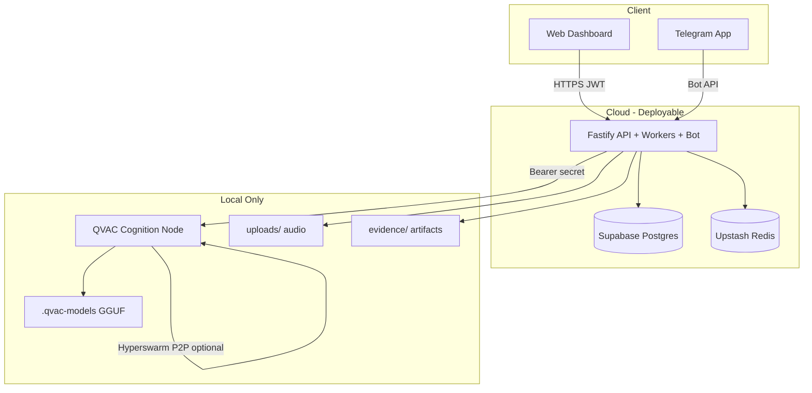

# KINKEEPER — Master Release Document

**Single source of truth for release, audit, deployment preparation, and hackathon readiness.**

| Field | Value |
|-------|-------|
| **Audit date** | 2026-06-20 |
| **Repository (remote)** | https://github.com/mohamedwael201193/KINKEEPER |
| **Local workspace** | `d:\route\KINKEEPER` |
| **Version** | 0.1.0 (monorepo root `package.json`) |
| **SDK** | `@qvac/sdk@0.13.3` |
| **Auditor roles** | Lead Release Engineer · Security Auditor · DevOps · Technical Writer · QA Lead · Repo Maintainer |

> **Security alert:** A GitHub personal access token was pasted in chat during this audit. **Revoke it immediately** in GitHub → Settings → Developer settings → Personal access tokens. Never commit tokens or paste them in issues, chat, or docs.

---

## Table of contents

1. [Executive summary](#1-executive-summary)
2. [Architecture](#2-architecture)
3. [User journey](#3-user-journey)
4. [Features (implemented)](#4-features-implemented)
5. [API reference](#5-api-reference)
6. [Environment variables](#6-environment-variables)
7. [Database](#7-database)
8. [Telegram workflow](#8-telegram-workflow)
9. [QVAC workflow](#9-qvac-workflow)
10. [Sentinel workflow](#10-sentinel-workflow)
11. [Cognoscente workflow](#11-cognoscente-workflow)
12. [Evidence chain workflow](#12-evidence-chain-workflow)
13. [Security model & audit findings](#13-security-model--audit-findings)
14. [Testing & verification status](#14-testing--verification-status)
15. [Known issues & technical debt](#15-known-issues--technical-debt)
16. [Deployment guide](#16-deployment-guide)
17. [Deployment topology](#17-deployment-topology)
18. [QVAC compliance review](#18-qvac-compliance-review)
19. [Hackathon notes for judges](#19-hackathon-notes-for-judges)
20. [Documentation cleanup plan](#20-documentation-cleanup-plan)
21. [`.gitignore` audit & patch](#21-gitignore-audit--patch)
22. [Pre-push audit results](#22-pre-push-audit-results)
23. [Git history plan (analysis only)](#23-git-history-plan-analysis-only)
24. [Release readiness scores](#24-release-readiness-scores)

---

## 1. Executive summary

### What KINKEEPER is

**KINKEEPER** is a local-first family AI protection platform built for the **QVAC Hackathon**. It combines:

- **Sentinel** — scam-call detection from audio recordings
- **Cognoscente** — cognitive baseline and drift detection from voice check-ins
- **Archivist** — SHA-256 hash-chained decision bundles (tamper-evident audit trail)
- **Evidence packets** — exportable JSON artifacts tied to alerts
- **Telegram Caregiver Companion** — instant alerts with acknowledge/evidence actions
- **Web dashboard** — onboarding, timeline, incidents, evidence, system health

All agent reasoning runs through a **local QVAC cognition node** (`apps/qvac-node`) using `@qvac/sdk` — not cloud LLM APIs.

### Why it exists

Families caring for aging relatives need **early warning** when:

1. A loved one receives a **scam phone call** (Sentinel)
2. **Cognitive change** appears in daily speech patterns (Cognoscente)

KINKEEPER detects these events locally, explains them with clinical-style reasoning (MedPsy), archives cryptographically linked evidence, and notifies caregivers via Telegram and the web dashboard.

### What problem it solves

| Problem | KINKEEPER response |
|---------|-------------------|
| Scam calls targeting elders | Sentinel transcribes + classifies calls; high-confidence scams → critical alert |
| Silent cognitive decline | Cognoscente tracks baselines and deviation; alerts on drift |
| No audit trail for AI decisions | Hash-chained `DecisionBundle` records per inference |
| Caregivers miss alerts | Telegram push with inline actions |
| Trust in AI outputs | Evidence packets + public proof endpoints + chain verification |

### Release verdict (2026-06-20)

| Dimension | Verdict |
|-----------|---------|
| **Hackathon demo** | **READY** with QVAC node running + one live Sentinel upload |
| **Full live pipeline demo** | **CONDITIONAL** — requires `dev:qvac-node`, audio upload, Telegram linked |
| **Production deployment** | **NOT READY** — no CI/CD, no deployment manifests, QVAC must stay local |
| **GitHub push** | **BLOCKED locally** — workspace is not a initialized git clone in audit environment; remote exists |

---

## 2. Architecture

### Monorepo layout

```
KINKEEPER/                          npm workspaces (Apache-2.0)
├── apps/
│   ├── api/                        Fastify REST + BullMQ workers + Telegram bot
│   ├── qvac-node/                  Local QVAC inference server (NEVER cloud)
│   └── web/                        Vite + React + Privy auth dashboard
├── packages/
│   ├── db/                         Prisma schema + client (PostgreSQL)
│   ├── qvac/                       QvacClient, QvacService, inference logger
│   └── shared/                     Zod schemas, agent types, constants
├── scripts/                        Verification & E2E scripts (12 files)
├── config/default/                 QVAC logger config
├── evidence/                       Generated proof artifacts (gitignored)
├── uploads/                        Family audio uploads (gitignored)
├── test-data/                      Sample WAV files for E2E
└── .qvac-models/                   Cached GGUF models (gitignored)
```

### Component responsibilities

| Component | Technology | Role | Deploy class |
|-----------|------------|------|--------------|
| **Frontend** | Vite, React 19, TanStack Router, Tailwind, Privy | Marketing + authenticated dashboard | **STATIC WEB → Vercel** |
| **Backend API** | Fastify 5, Helmet, CORS, rate-limit, JWT RS256 | REST, auth, family scope, job enqueue | **SERVER → Render** |
| **Workers** | BullMQ (embedded in API process) | Async Sentinel/Cognoscente pipelines | **WORKER → Render** (same service) |
| **Database** | Prisma + PostgreSQL | All persistent state | **DATABASE → Supabase** |
| **Queue** | Redis (Upstash) | BullMQ job backend | **MANAGED → Upstash** |
| **Telegram bot** | grammY (in-process with API) | Caregiver notifications + commands | **SERVER → Render** (with API) |
| **QVAC node** | `@qvac/sdk`, Fastify internal API | Local LLM + Whisper + MedPsy | **LOCAL ONLY — never Render/Vercel** |
| **Evidence files** | Local filesystem (`EVIDENCE_DIR`) | Packets, CSV logs, proof JSON | **LOCAL / optional R2 later** |

### Data flow (high level)



### Security model (summary)

- **Identity:** Privy (primary) + legacy password login (deprecated register)
- **Session:** RS256 JWT access token (15m) + httpOnly refresh cookie (30d)
- **Authorization:** JWT `familyId` claim + `requireFamily` middleware; queries scoped by family
- **QVAC node:** Bearer `QVAC_NODE_SECRET` on all `/internal/*`; CORS disabled; non-internal → 404
- **No Postgres RLS** — all row isolation is application-layer

---

## 3. User journey

Step-by-step verified flow (code + prior runtime audits):

| Step | Action | Route / service | Status |
|------|--------|---------------|--------|
| 1 | **New user lands** | `/` marketing page | ✅ Implemented |
| 2 | **Privy login** | `/login` → Privy OTP/wallet → `POST /auth/privy/sync` | ✅ Primary auth |
| 3 | **Auth complete** | `/auth/complete` → JWT issued | ✅ |
| 4 | **Create family** | `/onboarding/family` → `POST /families` | ✅ Seeds agents + devices |
| 5 | **Add elder** | Onboarding / `/app/family` → `POST /families/current/elders` | ✅ |
| 6 | **Add caregiver** | `/app/caregivers` → invite step | ✅ Invite email recorded |
| 7 | **Connect Telegram** | `/app/telegram` → `POST /telegram/link` → deep link → bot `/start {token}` | ✅ Fixed inline keyboard UX |
| 8 | **Baseline cognition scan** | Upload WAV → `POST /families/current/cognoscente/check-in` | ✅ Requires QVAC node + mic |
| 9 | **Protection activated** | Agents seeded active; baselines computed | ✅ |
| 10 | **Scam alert** | Upload call audio → `POST /families/current/sentinel/call-recording` | ✅ Requires QVAC node |
| 11 | **Evidence generation** | Archivist bundle → EvidencePacket JSON | ✅ Autonomous via CaregiverWorkflow |
| 12 | **Telegram notification** | `telegram.notifyFamilyCaregivers()` | ✅ When `TELEGRAM_ENABLED=true` |
| 13 | **Acknowledgement** | Telegram inline button or web resolve | ✅ Updates `Alert.resolved` |

**Demo account (prior verification):** `ben.felix2001193@gmail.com` · family **dom family** · elder **Margaret** · Telegram linked to @KINKEEPERxbot

---

## 4. Features (implemented)

### Authentication & users

- Privy passwordless sync (`POST /auth/privy/sync`)
- JWT access + refresh rotation
- Legacy password login (existing accounts only; register returns 410)
- User profile (`GET /users/me`)

### Family & onboarding

- Family creation with QVAC mesh public key
- Elder CRUD
- Caregiver invite tracking
- Onboarding progress API (`GET /families/current/onboarding`)
- Member list with Telegram link status

### Sentinel (scam detection)

- Multipart audio upload (50 MB limit)
- BullMQ async processing
- Two-stage classification: Qwen3-600M fast → MedPsy deep analysis
- Critical alert when SCAM + confidence ≥ 0.85
- Alert list + manual resolve

### Cognoscente (cognitive monitoring)

- Voice check-in upload
- Whisper transcription via QVAC
- MedPsy metric extraction (word-finding latency, semantic drift, repetition, sentiment)
- Rolling baselines + daily trends
- Warning alert on deviation

### Evidence & audit

- SHA-256 hash-chained decision bundles (Archivist)
- Chain verification API
- Evidence packet generation (JSON on disk + DB row)
- Inference log (Postgres + CSV in `EVIDENCE_DIR`)
- Export bundles CSV/JSON
- Public proof endpoints (`/public/proof`, `/public/runtime`)
- Incident timeline stages API

### Telegram

- Link token + deep link generation
- grammY bot: commands, inline menus, alert notifications
- Acknowledge + evidence callbacks
- Audit log actions: `telegram.link`, `telegram.notify`, `telegram.ack`

### Web dashboard

| Route | Page |
|-------|------|
| `/` | Marketing landing |
| `/login`, `/register` | Auth |
| `/onboarding/family` | Family setup wizard |
| `/app` | Timeline home + onboarding checklist |
| `/app/incidents` | Alerts list |
| `/app/incidents/:id` | Incident console |
| `/app/timeline` | Alert timeline |
| `/app/evidence` | Bundles, chain, packets |
| `/app/family` | Elder + baseline upload |
| `/app/caregivers` | Members |
| `/app/telegram` | Telegram linking |
| `/app/qvac` | QVAC runtime status |
| `/app/system` | System health |
| `/app/settings` | Settings (not in sidebar) |
| `/incidents/:id` | Deep link redirect |

### QVAC integration

- Local cognition node with provider (Hyperswarm)
- Models: Qwen3-600M, Whisper Tiny, MedPsy 1.7B/4B GGUF
- Delegation fallback (optional P2P)
- Runtime verification scripts

### Not implemented / out of scope

- Stripe billing
- Twilio telephony integration
- Postgres RLS
- CI/CD GitHub Actions
- Docker / Render / Vercel manifests
- Cloud-hosted QVAC inference
- Multi-tenant admin panel

---

## 5. API reference

**Base URL:** `API_URL` (default `http://localhost:3000`)

### Public (no auth)

| Method | Path | Purpose |
|--------|------|---------|
| GET | `/health` | Liveness: DB, QVAC, Redis |
| GET | `/ready` | Readiness: DB only |
| GET | `/public/proof` | Static E2E proof JSON from `EVIDENCE_DIR` |
| GET | `/public/runtime` | Live QVAC health + verified runtime JSON |

### Auth

| Method | Path | Auth | Purpose |
|--------|------|------|---------|
| POST | `/auth/privy/sync` | No | Privy → JWT |
| POST | `/auth/register` | No | **410 deprecated** |
| POST | `/auth/login` | No | Legacy password login |
| POST | `/auth/refresh` | Cookie | Rotate tokens |
| POST | `/auth/logout` | No | Revoke refresh |

### Users & families (JWT)

| Method | Path | Family | Purpose |
|--------|------|--------|---------|
| GET | `/users/me` | No | Profile |
| POST | `/families` | No | Create family |
| GET | `/families/current` | Yes | Current family |
| POST | `/families/current/elders` | Yes | Add elder |
| GET | `/families/current/elders` | Yes | List elders |
| GET | `/families/current/onboarding` | Yes | Onboarding state |
| POST | `/families/current/onboarding/caregiver-invite` | Yes | Record invite |

### Sentinel (JWT + family)

| Method | Path | Purpose |
|--------|------|---------|
| POST | `/families/current/sentinel/call-recording` | Upload audio → queue |
| GET | `/families/current/sentinel/alerts` | List sentinel alerts |
| POST | `/families/current/sentinel/alerts/:id/resolve` | Resolve alert |

### Cognoscente (JWT + family)

| Method | Path | Purpose |
|--------|------|---------|
| POST | `/families/current/cognoscente/check-in` | Upload check-in audio |
| GET | `/families/current/cognoscente/check-ins` | Recent check-ins |
| GET | `/families/current/cognoscente/trends` | 90-day trends |

### Evidence & alerts (JWT + family)

| Method | Path | Purpose |
|--------|------|---------|
| GET | `/families/current/evidence/bundles` | Decision bundles |
| GET | `/families/current/evidence/bundles/:id` | Single bundle |
| GET | `/families/current/evidence/chain` | Verify hash chain |
| POST | `/families/current/evidence/chain/verify` | Same as GET |
| POST | `/families/current/evidence/export` | Export bundles |
| GET | `/families/current/alerts` | All alerts |
| GET | `/families/current/alerts/:id` | Alert + bundle |
| GET/POST | `/families/current/alerts/:id/evidence-packet` | Get/generate packet |
| GET | `/families/current/inference-logs` | Inference logs |
| GET | `/families/current/inference-logs/export` | Export logs |
| GET | `/families/current/inference-logs/export/file` | Download CSV file |

### Dashboard (JWT + family)

| Method | Path | Purpose |
|--------|------|---------|
| GET | `/families/current/dashboard` | Aggregated dashboard |
| GET | `/families/current/members` | Members + Telegram status |
| GET | `/families/current/agents` | Agent records |
| GET | `/families/current/devices` | Devices |
| GET | `/families/current/evidence/packets` | Evidence packets |
| GET | `/families/current/alerts/:id/timeline` | Incident pipeline |
| GET | `/families/current/timeline` | Family timeline |
| GET | `/telegram/notifications` | Telegram audit entries |
| GET | `/families/current/qvac/runtime` | QVAC health + stats |
| GET | `/families/current/system-health` | System checks |

### Telegram HTTP (JWT)

| Method | Path | Purpose |
|--------|------|---------|
| POST | `/telegram/link` | Create link token + deep link |
| GET | `/telegram/status` | Link status + bot info |

### QVAC node internal (Bearer `QVAC_NODE_SECRET` — local only)

| Method | Path | Purpose |
|--------|------|---------|
| GET | `/internal/health` | Provider health + public key |
| POST | `/internal/completion` | Local LLM completion |
| POST | `/internal/transcribe` | Local Whisper transcribe |

**Source files:** `apps/api/src/routes/*.ts`, `apps/qvac-node/src/routes/internal.ts`, `apps/api/src/app.ts`

---

## 6. Environment variables

Variables validated in code (`apps/api/src/config/env.ts`, `apps/qvac-node/src/config/env.ts`, `apps/web/src/lib/config.ts`).

### Required for API startup

| Variable | Description | Example / source |
|----------|-------------|------------------|
| `DATABASE_URL` | Pooled Postgres (Supabase pooler :6543) | Supabase dashboard |
| `DATABASE_DIRECT_URL` | Direct Postgres (:5432) for migrations | Supabase dashboard |
| `REDIS_URL` | BullMQ backend | Upstash Redis TLS URL |
| `APP_URL` | Frontend origin (Telegram deep links) | `https://app.example.com` prod |
| `API_URL` | Backend public URL | `https://api.example.com` prod |
| `CORS_ORIGINS` | Comma-separated allowed origins | `https://app.example.com` |
| `QVAC_NODE_URL` | Local QVAC node URL | `http://localhost:3001` or LAN IP |
| `QVAC_NODE_SECRET` | Bearer secret (min 32 chars) | `openssl rand -hex 32` |
| `PRIVY_APP_ID` | Privy application ID | Privy dashboard |
| `PRIVY_APP_SECRET` | Privy server secret | Privy dashboard |
| `JWT_PRIVATE_KEY_FILE` | RS256 private PEM path | `.jwt-private.pem` |
| `JWT_PUBLIC_KEY_FILE` | RS256 public PEM path | `.jwt-public.pem` |

### Required for QVAC node

| Variable | Description |
|----------|-------------|
| `QVAC_NODE_PORT` | Default `3001` |
| `QVAC_NODE_SECRET` | Same as API |
| `QVAC_MODELS_CACHE_DIR` | e.g. `./.qvac-models` |
| `QVAC_HYPERSWARM_SEED` | 64-char hex seed |

### Optional / feature flags

| Variable | Default | Purpose |
|----------|---------|---------|
| `NODE_ENV` | `development` | Runtime mode |
| `APP_ENV` | `development` | App environment label |
| `APP_PORT` | `3000` | API port |
| `JWT_ACCESS_EXPIRES_IN` | `15m` | Access token TTL |
| `JWT_REFRESH_EXPIRES_IN` | `30d` | Refresh token TTL |
| `UPLOAD_DIR` | `./uploads` | Audio upload storage |
| `EVIDENCE_DIR` | `./evidence` | Proof artifacts |
| `LOG_LEVEL` | `info` | Pino log level |
| `TELEGRAM_BOT_TOKEN` | — | Telegram BotFather token |
| `TELEGRAM_ENABLED` | `false` | Enable bot polling |
| `TELEGRAM_LINK_TOKEN_TTL_SEC` | `900` | Link token expiry |
| `MEDPSY_MODEL` | `1.7B` | MedPsy variant |
| `PRELOAD_MEDPSY` | `false` | Block startup until MedPsy loaded |
| `HF_TOKEN` | — | HuggingFace download token |
| `VITE_PRIVY_APP_ID` | — | Frontend Privy ID |
| `VITE_API_URL` | `/api` | Frontend API base (Vite proxy in dev) |

### Missing from `.env.example` (must add)

| Variable | Required by | Notes |
|----------|-------------|-------|
| `REDIS_URL` | API env schema | **Critical** — API won't start without it |
| `VITE_API_URL` | Web config | Optional in dev (proxy) |

### Documented in ENV_REQUIREMENTS.md but NOT in code schema

These appear in planning docs only — **not loaded by current code:**

`SUPABASE_URL`, `SUPABASE_ANON_KEY`, `SUPABASE_SERVICE_ROLE_KEY`, `JWT_PRIVATE_KEY` (inline PEM), `WEBAUTHN_*`, `RESEND_*`, `SENTRY_*`, `STRIPE_*`, `TWILIO_*`, `R2_*`

### Classification

| Class | Variables |
|-------|-----------|
| **Production required** | DATABASE_*, REDIS_URL, APP_URL, API_URL, CORS_ORIGINS, PRIVY_*, JWT keys, QVAC_NODE_SECRET |
| **Local only** | QVAC_NODE_URL (must point to local/LAN machine), QVAC_MODELS_CACHE_DIR, QVAC_HYPERSWARM_SEED |
| **Production optional** | TELEGRAM_*, HF_TOKEN |
| **Development only** | localhost URLs in APP_URL/CORS_ORIGINS |

---

## 7. Database

**ORM:** Prisma · **Provider:** PostgreSQL · **Schema:** `packages/db/prisma/schema.prisma`  
**Migration strategy:** `db:push` (no `prisma/migrations/` folder committed)

### Tables (17 models)

| Table | Purpose | Key relationships |
|-------|---------|-------------------|
| `users` | Accounts (Privy DID, optional password) | → family_members, telegram_* |
| `refresh_tokens` | Hashed refresh tokens | → users |
| `families` | Family unit + mesh public key | → elders, alerts, bundles, … |
| `family_members` | User ↔ family roles | admin, caregiver, viewer |
| `elders` | Protected persons | → check_ins, baselines, trends, alerts |
| `devices` | Mesh device registry | cognition_node, phones, archive |
| `agents` | Agent status records | sentinel, cognoscente, archivist, … |
| `agent_logs` | Workflow log messages | |
| `alerts` | Incidents (scam/cognitive) | → bundle, evidence_packet |
| `decision_bundles` | Hash-chained AI decisions | unique `hash`, `previousHash` chain |
| `evidence_packets` | Exported JSON artifacts | 1:1 with alert |
| `cognoscente_check_ins` | Voice check-in records | |
| `cognoscente_baselines` | Per-metric baselines | unique (elderId, metric) |
| `cognoscente_trends` | Daily trend aggregates | |
| `memory_reasoning_traces` | LLM thinking text | |
| `inference_logs` | QVAC telemetry | |
| `audit_logs` | User/system actions | telegram.*, etc. |
| `telegram_links` | One-time link tokens | |
| `telegram_chats` | Linked Telegram chat IDs | |
| `sentinel_call_recordings` | Call pipeline state | |

**No RLS policies** — family isolation enforced in API route handlers via `request.user.familyId`.

---

## 8. Telegram workflow

**Files:** `apps/api/src/services/telegram.service.ts`, `apps/api/src/routes/telegram.ts`

### Link flow

1. Caregiver opens `/app/telegram` → `POST /telegram/link` (JWT)
2. API creates `TelegramLink` row (UUID token, TTL 900s default)
3. Response includes `https://t.me/{bot}?start={token}`
4. User opens Telegram → `/start {token}` → `TelegramChat` upserted → audit `telegram.link`

### Bot UX (2026-06-20 fixes)

- **Inline keyboard** on welcome/status (Status | Recent alerts | Help) — reliable across clients
- Reply keyboard also supported
- **Recent alerts** lists up to 5 alerts with Acknowledge + Evidence inline buttons
- **localhost URL buttons omitted** — Telegram rejects `http://localhost` inline URLs

### Alert notification flow

```
Sentinel/Cognoscente high-risk alert
  → CaregiverWorkflowService
  → EvidencePacket generated
  → telegram.notifyFamilyCaregivers()
  → Message to all linked family members
  → audit: telegram.notify
```

### Bot commands

`/start`, `/link`, `/menu`, `/help`, `/status`, `/alerts`, `/evidence`, `/ack` + inline callbacks

### Production requirements

- `TELEGRAM_BOT_TOKEN` from BotFather
- `TELEGRAM_ENABLED=true`
- `APP_URL` must be **HTTPS** (non-localhost) for "Open in KINKEEPER" inline URL buttons

---

## 9. QVAC workflow

**Compliance reference:** https://docs.qvac.tether.io/quickstart/

### Architecture (correct pattern)

| Process | Location | SDK usage |
|---------|----------|-----------|
| `apps/qvac-node` | **Local machine** (demo laptop) | Direct `@qvac/sdk` — loadModel, completion, transcribe |
| `apps/api` | Cloud or local | HTTP client only — **never loads models** |
| `packages/qvac` | Shared library | QvacClient + QvacService |

### Startup sequence

1. `npm run dev:qvac-node` — starts provider (Hyperswarm), preloads Qwen3 + Whisper
2. MedPsy loads on first deep analysis (or preload if `PRELOAD_MEDPSY=true`)
3. API calls `QVAC_NODE_URL/internal/*` with Bearer secret

### Models used

| Model | Purpose |
|-------|---------|
| Qwen3-600M Q4 | Fast Sentinel classification |
| Whisper Tiny | Audio transcription |
| MedPsy 1.7B/4B GGUF | Deep clinical reasoning |

### Warnings

- **NEVER deploy QVAC node to Render/Vercel** — violates local inference architecture
- Production API must point `QVAC_NODE_URL` to a **caregiver's local machine or dedicated edge device** on LAN/VPN
- Node.js ≥ 22.17 required per QVAC docs
- Models cache ~4 GB disk (MedPsy 1.7B ~1.2 GB)
- `0.0.0.0` bind on QVAC node — protect with firewall + secret; not public internet without tunnel

### Optional delegation

- Hyperswarm P2P provider/consumer for cross-device inference
- Verified by `npm run delegate:verify` and `p2p:verify` (requires 2 devices for true P2P)

---

## 10. Sentinel workflow

**File:** `apps/api/src/services/sentinel.service.ts`

1. `POST /families/current/sentinel/call-recording` — save audio to `UPLOAD_DIR`, enqueue BullMQ job
2. Worker invokes SentinelService:
   - Transcribe via QVAC Whisper (if no transcript)
   - Fast classify with Qwen3-600M
   - If UNCERTAIN or low confidence → MedPsy deep analysis
3. Archivist commits hash-chained DecisionBundle
4. Build AgentDecisionAudit → store in alert metadata
5. If SCAM + confidence ≥ 0.85:
   - Create critical Alert
   - CaregiverWorkflow → EvidencePacket + Telegram notify

**Test:** `npm run e2e:verify` → `SENTINEL_E2E_REPORT.md` · sample: `test-data/sentinel-scam-call.wav`

---

## 11. Cognoscente workflow

**File:** `apps/api/src/services/cognoscente.service.ts`

1. `POST /families/current/cognoscente/check-in` — upload WAV
2. Transcribe (QVAC Whisper)
3. Load baselines from `CognoscenteBaseline`
4. MedPsy completion → cognitive metrics JSON
5. Update baselines + daily `CognoscenteTrend`
6. Archivist commit bundle
7. If analysis triggers alert → warning Alert → CaregiverWorkflow

**Test:** `COGNOSCENTE_E2E_REPORT.md` · sample: `test-data/cognoscente-checkin.wav`

---

## 12. Evidence chain workflow

**Files:** `archivist.service.ts`, `evidence-packet.service.ts`, `decision-audit.ts`

### Hash chain (Archivist)

1. Canonical JSON of decision bundle
2. SHA-256 hash computed from persisted DB row (post-insert fix)
3. `previousHash` links to prior bundle (genesis `"0"`)
4. `verifyChain()` recomputes and validates linkage per family

### Evidence packet

1. Triggered post-alert by CaregiverWorkflow
2. JSON written to `{EVIDENCE_DIR}/packets/{alertId}.json`
3. `contentHash` stored in `evidence_packets` table
4. Embeds chain verification snapshot

### Public proof

- `GET /public/proof` serves committed E2E JSON from `evidence/` directory
- Used for hackathon judge verification without auth

### Maintenance

- `scripts/repair-chain.ts` — fixes legacy hash drift

---

## 13. Security model & audit findings

### Current controls (verified in code)

| Control | Implementation | File |
|---------|----------------|------|
| Helmet headers | `@fastify/helmet` | `app.ts` |
| CORS allowlist | `CORS_ORIGINS` env | `app.ts` |
| Rate limiting | 100/min global; auth routes stricter | `app.ts`, `auth.ts` |
| JWT RS256 | `@fastify/jwt` | `plugins/auth.ts` |
| Refresh httpOnly cookie | `sameSite: strict`, `secure` in prod | `auth.ts` |
| Family scoping | `requireFamily` + query filters | route handlers |
| QVAC node isolation | Bearer secret, CORS off, 404 non-internal | `qvac-node/main.ts` |
| Upload limit | 50 MB multipart | `app.ts` |
| Password hashing | bcrypt (legacy path) | `auth.service.ts` |
| Telegram link tokens | UUID, TTL, single-use | `telegram.service.ts` |

### Security findings

| ID | Severity | Finding | Recommendation |
|----|----------|---------|----------------|
| SEC-01 | **CRITICAL** | GitHub PAT exposed in chat during audit | Revoke token immediately; rotate if used anywhere |
| SEC-02 | **HIGH** | No Postgres RLS — DB credential breach exposes all families | Add RLS before multi-tenant production |
| SEC-03 | **HIGH** | QVAC node binds `0.0.0.0` — reachable on LAN | Firewall port 3001; VPN/tunnel only in prod |
| SEC-04 | **MEDIUM** | `/public/proof` and `/public/runtime` unauthenticated | Acceptable for hackathon; restrict in production |
| SEC-05 | **MEDIUM** | Legacy password login still active | Disable after full Privy migration |
| SEC-06 | **MEDIUM** | `POST /auth/register` returns 410 but endpoint exists | Remove route or return consistent error |
| SEC-07 | **LOW** | README claims "Frontend NOT BUILT" — stale | Update to prevent misconfiguration |
| SEC-08 | **LOW** | JWT key files exist on disk (`.jwt-private.pem`) | Ensure gitignored; use secret manager in prod |
| SEC-09 | **INFO** | `.env` present locally (gitignored) | Never commit; use platform env vars on deploy |
| SEC-10 | **INFO** | Evidence/upload dirs may contain PII audio | Keep gitignored; encrypt at rest for production |

### Secrets scan (2026-06-20)

- **No hardcoded tokens** found in `apps/` or `scripts/` source
- `.env`, `.jwt-private.pem` exist locally — correctly gitignored after patch
- `dist/` bundles contain vendor code only — build artifacts should not be committed
- User-pasted GitHub token **not written to any repository file**

### Unsafe patterns checked

| Check | Result |
|-------|--------|
| Admin routes without auth | None found |
| Test-only debug endpoints | None (public proof is intentional) |
| Unsafe CORS (`*`) | Not used — explicit allowlist |
| SQL injection | Prisma parameterized queries |
| Path traversal on uploads | Uses generated paths under `UPLOAD_DIR` |
| Telegram endpoint auth | `/telegram/link` requires JWT ✅ |

---

## 14. Testing & verification status

### Automated tests (2026-06-20 audit run)

| Command | Result | Details |
|---------|--------|---------|
| `npm run typecheck` | **FAIL** | Vite plugin type mismatch (`apps/web/vite.config.ts` — duplicate vite versions in monorepo) |
| `npm run lint` | **FAIL** | `family-page.tsx:181` — unused `familyQuery` |
| `npm run build` | **PASS** | All 6 workspaces compile |
| `npm run test:unit` | **PASS** | 4/4 tests (archivist, decision-audit, inference-logger) |
| `npm run test:integration` | **PASS** | 1/1 auth integration (register/login/JWT) |

### Verification scripts (manual / infra-dependent)

| Script | Purpose | Status |
|--------|---------|--------|
| `npm run qvac:smoke` | Basic QVAC inference | Pass when node running |
| `npm run qvac:runtime` | Full runtime report | Pass (see QVAC_RUNTIME_REPORT.md) |
| `npm run e2e:verify` | Sentinel + Cognoscente E2E | **Needs update** — uses deprecated register |
| `npm run delegate:verify` | Delegation fallback | Pass (see DELEGATION_VERIFICATION_REPORT.md) |
| `npm run p2p:verify` | Cross-device P2P | Requires 2 devices |
| `npm run verify:db` | DB connectivity | Pass with Supabase |
| `scripts/live-dom-pipeline.ts` | Live pipeline | Pass after chain repair |

### CI/CD

**No `.github/workflows/` in repository.** All verification is manual.

### Coverage gaps

- No Telegram bot automated tests
- No Sentinel/Cognoscente service unit tests
- No web component/E2E tests (Playwright/Cypress)
- No load/security scanning in CI

---

## 15. Known issues & technical debt

| Issue | Impact | Priority |
|-------|--------|----------|
| Root typecheck fails (Vite types) | Blocks `tsc -b` clean gate | P0 before push |
| ESLint unused var in family-page | Blocks lint gate | P1 |
| `REDIS_URL` missing from `.env.example` | Setup confusion | P1 |
| README stale ("frontend not built") | Documentation drift | P1 |
| `e2e:verify` uses deprecated register | E2E script fails on Privy migration | P1 |
| No Prisma migrations folder | Schema drift risk in production | P2 |
| No CI/CD | No automated release gates | P2 |
| No deployment manifests | Manual deploy only | P2 |
| Telegram localhost URL buttons disabled | Dev UX — no "Open in app" button locally | P3 (by design) |
| Settings page not in sidebar | Discoverability | P3 |
| 26 duplicate markdown reports at root | Repo hygiene | P2 |
| Local workspace not a git clone | Cannot push from audit machine | P0 for release engineer |

---

## 16. Deployment guide

> **DO NOT deploy QVAC node to cloud.** See [Section 18](#18-qvac-compliance-review).

### Prerequisites

- Node.js ≥ 22.17, npm ≥ 10.9
- Supabase Postgres project
- Upstash Redis instance
- Privy application (app ID + secret)
- Telegram bot token (optional)
- Local machine for QVAC node with GPU recommended

### Step 1 — Database (Supabase)

```bash
# Set DATABASE_URL (pooler) and DATABASE_DIRECT_URL (direct)
npm run db:push
npm run verify:db
```

### Step 2 — Secrets & keys

```bash
# Generate JWT RS256 key pair
node scripts/generate-jwt-keys.js   # if script exists, else openssl

# Generate QVAC secret (same value for API + node)
openssl rand -hex 32

# Generate Hyperswarm seed (64 hex chars)
openssl rand -hex 32
```

### Step 3 — QVAC node (LOCAL ONLY)

```bash
npm run download:medpsy          # recommended
npm run dev:qvac-node            # terminal 1 — port 3001
```

Set on local machine:
- `QVAC_NODE_URL=http://<local-ip>:3001` (API must reach this)
- `QVAC_MODELS_CACHE_DIR=./.qvac-models`
- `QVAC_HYPERSWARM_SEED=<64-char-hex>`

### Step 4 — Backend + workers (Render)

Deploy `apps/api` as Node web service:

```bash
npm run build
npm run start:api                # node apps/api/dist/main.js
```

**Render env vars:** all API required vars from Section 6.  
**Start command:** `npm run start:api` from monorepo root with `dotenv` or platform env.  
**Worker note:** BullMQ workers run in same process as API (`main.ts` starts workers).

### Step 5 — Frontend (Vercel)

Deploy `apps/web`:

```bash
npm run build -w @kinkeeper/web
```

**Vercel settings:**
- Root: `apps/web` or monorepo with filter
- Build: `npm run build`
- Output: `dist`
- Env: `VITE_PRIVY_APP_ID`, `VITE_API_URL=https://api.yourdomain.com`

### Step 6 — Telegram

1. Create bot via BotFather → `TELEGRAM_BOT_TOKEN`
2. Set `TELEGRAM_ENABLED=true` on API service
3. Set `APP_URL=https://your-vercel-domain.vercel.app`
4. API must stay running (long polling)

### Step 7 — Post-deploy verification

```bash
curl https://api.yourdomain.com/health
curl https://api.yourdomain.com/public/runtime
# Upload test audio via dashboard with QVAC node running locally
```

### What NEVER goes to cloud

| Component | Reason |
|-----------|--------|
| `apps/qvac-node` | QVAC local inference requirement |
| `.qvac-models/` | Multi-GB model weights |
| `uploads/` | Raw audio PII |
| `evidence/` (optional) | Can move to R2 later with encryption |

---

## 17. Deployment topology

### Service classification

| Service | Deploy target | Never deploy |
|---------|---------------|--------------|
| `apps/web` | **Vercel** (static SPA) | — |
| `apps/api` + BullMQ workers + Telegram bot | **Render** (Node service) | — |
| PostgreSQL | **Supabase** | — |
| Redis | **Upstash** | — |
| `apps/qvac-node` | — | **LOCAL ONLY** |
| `.qvac-models` | — | **LOCAL ONLY** |
| `uploads/`, `evidence/` | — | **LOCAL ONLY** (dev); R2 optional prod |
| `test-data/` | — | **Development only** |
| Verification scripts | — | **Development only** |
| Root markdown reports | — | **Delete/merge** (see Section 20) |

### Production architecture diagram

```
                    ┌─────────────────────────────────┐
                    │         Vercel (Static)          │
                    │         apps/web                 │
                    │    VITE_API_URL → Render API     │
                    └───────────────┬─────────────────┘
                                    │ HTTPS
                    ┌───────────────▼─────────────────┐
                    │         Render (Node)            │
                    │  apps/api + Workers + Telegram   │
                    └───┬─────────────┬────────────────┘
                        │             │
              ┌─────────▼──┐   ┌──────▼──────┐
              │  Supabase  │   │   Upstash   │
              │  Postgres  │   │    Redis    │
              └────────────┘   └─────────────┘
                        │
                        │ QVAC_NODE_URL (VPN/LAN)
              ┌─────────▼──────────────────────────┐
              │   Caregiver's local machine         │
              │   apps/qvac-node :3001              │
              │   .qvac-models + GPU inference      │
              └────────────────────────────────────┘
                        │
              ┌─────────▼──────────┐
              │  Telegram Bot API  │
              │  (caregiver phones)│
              └────────────────────┘
```

---

## 18. QVAC compliance review

**Reference:** https://docs.qvac.tether.io/quickstart/

| Requirement | KINKEEPER status |
|-------------|------------------|
| Node.js ≥ 22.17 | ✅ `engines` in root package.json |
| `@qvac/sdk` usage | ✅ v0.13.3 in packages/qvac |
| Local model loading | ✅ Only in `apps/qvac-node` via QvacService |
| API separation | ✅ API uses HTTP client, not SDK directly |
| No cloud inference node | ✅ **Compliant** — qvac-node intended for local machine |
| QVAC_CONFIG_PATH | ✅ Set in packages/qvac/src/setup.ts |
| Illegal deployment pattern | ❌ **Would violate** if qvac-node deployed to Render |
| Inference logging | ✅ CSV + JSONL in EVIDENCE_DIR + Postgres |

### Service classification (QVAC lens)

| Service | Class |
|---------|-------|
| apps/qvac-node | **LOCAL ONLY** |
| packages/qvac (library) | **SHARED** |
| apps/api (orchestration) | **SERVER** — cloud OK |
| apps/api/workers | **WORKER** — cloud OK |
| apps/web | **STATIC WEB** — cloud OK |

---

## 19. Hackathon notes for judges

### What to demo (5-minute path)

See `DEMO_RUNBOOK.md` for frozen commands. Summary:

1. Show `/public/proof` — pre-verified Sentinel + Cognoscente E2E JSON
2. Start QVAC node → `GET /public/runtime` shows live provider key
3. Login via Privy → dashboard timeline
4. Upload scam audio → alert appears → evidence chain valid
5. Telegram notification → acknowledge button

### What is REAL vs DEMO

| Real (live inference) | Demo / proof artifacts |
|-----------------------|------------------------|
| QVAC local LLM + Whisper + MedPsy | `evidence/sentinel-e2e.json` fallback on empty timeline |
| Hash-chained decision bundles | Public proof endpoint |
| Telegram bot notifications | Requires linked account + live alert |
| Privy auth | — |
| P2P delegation | Requires 2nd physical device |

### What is local vs cloud

| Local | Cloud |
|-------|-------|
| QVAC inference | Supabase Postgres |
| Model files (.qvac-models) | Upstash Redis |
| Audio uploads (dev) | Privy auth service |
| QVAC node process | (Future) Vercel frontend + Render API |

### Judge talking points

1. **Local-first AI** — no OpenAI/Anthropic API; MedPsy clinical model on device
2. **Tamper-evident audit trail** — hash chain across all agent decisions
3. **Autonomous caregiver workflow** — detect → explain → archive → notify without manual steps
4. **QVAC SDK 0.13.3** — Whisper metadata, stopReason, backendDevice telemetry

---

## 20. Documentation cleanup plan

**Do not delete until reviewed.** 26 root markdown files audited:

| File | Decision | Reason |
|------|----------|--------|
| `MASTER_RELEASE_DOCUMENT.md` | **KEEP** | Single source of truth (this file) |
| `README.md` | **KEEP** (update) | Entry point — must sync with current state (frontend exists, add link to master doc) |
| `DEMO_RUNBOOK.md` | **KEEP** | Judge reproduction path |
| `ENV_REQUIREMENTS.md` | **MERGE → MASTER** | Env vars now in Section 6; delete after review |
| `DEPLOYMENT_READINESS_REPORT.md` | **MERGE → MASTER** | Superseded by Sections 16–17, 22 |
| `RELEASE_READINESS_REPORT.md` | **MERGE → MASTER** | Superseded by Sections 14, 24 |
| `PRODUCTION_READINESS_REPORT.md` | **MERGE → MASTER** | Historical fixes documented in Section 15 |
| `BACKEND_COMPLETION_REPORT.md` | **DELETE** (after review) | Historical phase audit |
| `BACKEND_DECISION.md` | **DELETE** (after review) | ADR captured in Section 2 |
| `BACKEND_MAXIMUM_SCORE_READINESS.md` | **MERGE → MASTER** | Telegram/evidence proof in Sections 8, 12 |
| `COGNOSCENTE_E2E_REPORT.md` | **KEEP** (evidence) | Generated proof artifact reference |
| `SENTINEL_E2E_REPORT.md` | **KEEP** (evidence) | Generated proof artifact reference |
| `QVAC_RUNTIME_REPORT.md` | **KEEP** (evidence) | Generated proof artifact reference |
| `EVIDENCE_SYSTEM_REPORT.md` | **KEEP** (evidence) | Chain verification proof |
| `DELEGATION_VERIFICATION_REPORT.md` | **KEEP** (evidence) | QVAC delegation proof |
| `TRUE_P2P_VERIFICATION_REPORT.md` | **KEEP** (evidence) | P2P proof |
| `SDK_013_MIGRATION_REPORT.md` | **DELETE** (after review) | Migration complete; note in Section 1 |
| `FINAL_PRE_FRONTEND_REPORT.md` | **DELETE** | Obsolete — frontend built |
| `IMPLEMENTATION_TODO.md` | **DELETE** | Superseded by Section 15 |
| `MVP_ENV_CHECKLIST.md` | **MERGE → MASTER** | Section 6 |
| `CURSOR_FINAL_MASTER_PROMPT.md` | **DELETE** (or move to `.internal/`) | 2280-line build spec — not user-facing |
| `projects.md` | **DELETE** (or move to `.internal/`) | Competitor research — not release doc |
| `PROJECT_REALITY_CHECK.md` | **DELETE** | Historical deadline assessment |
| `REPRODUCIBILITY_REPORT.md` | **MERGE → MASTER** | Section 19 |
| `RUNTIME_VERIFICATION_MASTER_REPORT.md` | **MERGE → MASTER** | Section 14 |
| `WINNING_BUILD_PLAN.md` | **DELETE** | Historical planning |
| `WINNING_STRATEGY_REPORT.md` | **DELETE** (or archive) | 669-line audit — key items merged |

**Recommended post-review state:** `README.md` + `MASTER_RELEASE_DOCUMENT.md` + `DEMO_RUNBOOK.md` + `evidence/*.json` reports only.

---

## 21. `.gitignore` audit & patch

### Verified repository artifacts (must not commit)

| Path | Present locally | Was gitignored (before patch) | Now gitignored |
|------|-----------------|-------------------------------|----------------|
| `node_modules/` | Yes | ✅ | ✅ |
| `dist/` | Yes (apps/api, web, qvac-node) | ✅ | ✅ |
| `.env` | Yes | ✅ | ✅ |
| `.jwt-*.pem` | Yes | ✅ | ✅ |
| `.qvac-models/` | Yes | ✅ | ✅ |
| `uploads/` | Yes | ✅ | ✅ |
| `evidence/` | Yes | ❌ **GAP** | ✅ **FIXED** |
| `coverage/` | No | ✅ | ✅ |
| `test-data/*.wav` | Yes | ❌ | ✅ **ADDED** |
| `*.log` | Maybe | ✅ | ✅ |
| `.vercel/`, `.render/` | No | ❌ | ✅ **ADDED** |
| `LIVE_PIPELINE_RESULTS.json` | Maybe | ❌ | ✅ **ADDED** |
| OS/editor files | — | Partial | ✅ **EXPANDED** |

**Patch applied:** `.gitignore` updated 2026-06-20 (see file in repo root).

---

## 22. Pre-push audit results

**Audit timestamp:** 2026-06-20 ~21:14 UTC · **Machine:** Windows 10 · **Git:** not initialized in local workspace

| Gate | Status | Notes |
|------|--------|-------|
| Typecheck (`npm run typecheck`) | ❌ FAIL | Vite plugin type conflict in monorepo |
| Lint (`npm run lint`) | ❌ FAIL | 1 error: unused `familyQuery` |
| Build (`npm run build`) | ✅ PASS | All workspaces |
| Unit tests | ✅ PASS | 4/4 |
| Integration tests | ✅ PASS | 1/1 |
| Security scan (manual) | ⚠️ WARN | See Section 13; PAT exposure external |
| Dead link scan | ⏭️ SKIP | No automated tool |
| Unused file scan | ⚠️ WARN | 26 root markdown files redundant |
| Unused dependency scan | ⏭️ SKIP | Recommend `depcheck` before push |
| Circular dependency scan | ⏭️ SKIP | No `madge` configured |
| Broken route scan | ✅ PASS | Routes registered in app.ts match handlers |
| Broken import scan | ✅ PASS | Build succeeds |

### Missing environment variables (for clean deploy)

| Variable | Status |
|----------|--------|
| `REDIS_URL` | Required by API — **missing from `.env.example`** |
| Production `APP_URL` (HTTPS) | Required for Telegram URL buttons |
| Production `CORS_ORIGINS` | Must match Vercel domain |
| `VITE_API_URL` | Required on Vercel build |

### Recommended pre-push checklist

- [ ] Fix typecheck (dedupe vite or exclude web from `tsc -b`)
- [ ] Fix lint error in `family-page.tsx`
- [ ] Add `REDIS_URL` to `.env.example`
- [ ] Update README (frontend built, link to MASTER_RELEASE_DOCUMENT.md)
- [ ] Initialize git / clone from GitHub remote
- [ ] Verify `.env` and secrets not staged
- [ ] Run `npm run e2e:verify` after Privy script update
- [ ] Revoke exposed GitHub PAT

---

## 23. Git history plan (analysis only)

> **NOT EXECUTED** — no git commands that modify history were run.

### Current state

- **Local workspace (`d:\route\KINKEEPER`):** `fatal: not a git repository` — not a clone of GitHub remote
- **Remote:** https://github.com/mohamedwael201193/KINKEEPER (not inspected live — no token used)
- **Recommendation:** Clone fresh from GitHub or `git init` + add remote + pull

### Recommended release strategy (no history rewriting)

1. **Clone** remote repository to clean machine
2. **Copy** verified working tree or merge via PR
3. **Single release commit** or small logical commits:
   - `docs: add MASTER_RELEASE_DOCUMENT as single source of truth`
   - `chore: expand .gitignore for evidence and artifacts`
   - `fix: lint and typecheck gates`
4. **Tag:** `v0.1.0-hackathon` after gates pass
5. **Do NOT:** `git reset`, `rebase`, `filter-branch`, force push, amend old commits, fabricate timestamps

### If secrets were ever committed to remote

1. Rotate all exposed credentials (Supabase, Privy, Telegram, QVAC secret, JWT keys)
2. Use `git log -p` on remote to search for `.env` or token patterns
3. If found: GitHub secret scanning + new keys — consider `git filter-repo` only with explicit owner approval (not done in this audit)

---

## 24. Release readiness scores

**Scoring date:** 2026-06-20 · **Method:** Code verification + automated gate runs + prior runtime reports

| Category | Score | Rationale |
|----------|-------|-----------|
| **Overall release readiness** | **68 / 100** | Core product works; gates and deploy artifacts incomplete |
| **Security** | **72 / 100** | Good API middleware; no RLS; public proof endpoints; PAT exposure external |
| **Deployment readiness** | **48 / 100** | No Dockerfile/render.yaml/vercel.json; QVAC topology documented but not wired |
| **Documentation quality** | **55 / 100** | 26 fragmented docs; this master doc consolidates; README stale |
| **Repository hygiene** | **42 / 100** | Local non-git workspace; redundant markdown; evidence/dist were not fully gitignored |
| **QVAC compliance** | **88 / 100** | Correct local-node separation; SDK 0.13.3; delegation optional |
| **Hackathon readiness** | **82 / 100** | Strong demo path + proof artifacts; needs live QVAC for full wow |
| **Production readiness** | **45 / 100** | No CI, no RLS, no deployment manifests, local QVAC coupling |

### Weighted verdict

| Audience | Ready? |
|----------|--------|
| **QVAC hackathon submission** | ✅ **YES** — with QVAC node running and DEMO_RUNBOOK |
| **GitHub public release** | ⚠️ **AFTER** lint/typecheck fixes + git setup + doc cleanup |
| **Production SaaS** | ❌ **NO** — significant security and ops gaps |

### Top 5 blockers before GitHub push

1. Fix `npm run typecheck` and `npm run lint`
2. Initialize proper git clone; verify secrets not tracked
3. Add `REDIS_URL` to `.env.example`
4. Update README to point to this document
5. Revoke exposed GitHub personal access token

---

## Appendix A — NPM scripts reference

| Script | Purpose |
|--------|---------|
| `dev:api` | API + workers + Telegram (tsx watch) |
| `dev:qvac-node` | Local QVAC node |
| `dev:web` | Vite frontend |
| `build` | Build all workspaces |
| `test:unit` / `test:integration` | Vitest |
| `qvac:runtime` | Generate QVAC_RUNTIME_REPORT.md |
| `e2e:verify` | Full agent E2E |
| `db:push` | Apply Prisma schema |

## Appendix B — Key source file index

| Area | Path |
|------|------|
| API entry | `apps/api/src/main.ts` |
| App wiring | `apps/api/src/app.ts` |
| Auth | `apps/api/src/plugins/auth.ts`, `routes/auth.ts` |
| Sentinel | `apps/api/src/services/sentinel.service.ts` |
| Cognoscente | `apps/api/src/services/cognoscente.service.ts` |
| Archivist | `apps/api/src/services/archivist.service.ts` |
| Evidence | `apps/api/src/services/evidence-packet.service.ts` |
| Telegram | `apps/api/src/services/telegram.service.ts` |
| QVAC node | `apps/qvac-node/src/main.ts` |
| QVAC client | `packages/qvac/src/qvac-client.ts` |
| Prisma schema | `packages/db/prisma/schema.prisma` |
| Web router | `apps/web/src/routes/router.tsx` |

---

*End of MASTER_RELEASE_DOCUMENT.md — maintained as the single source of truth for KINKEEPER release preparation.*
