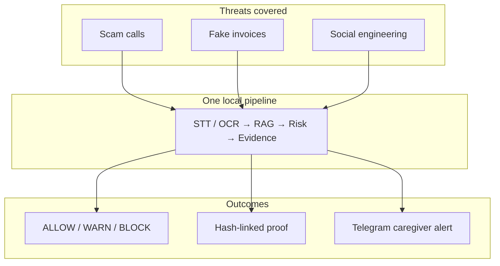
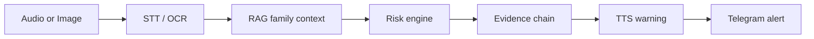
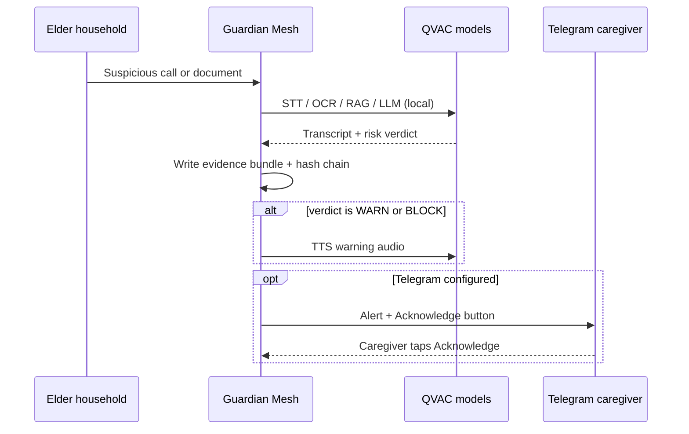
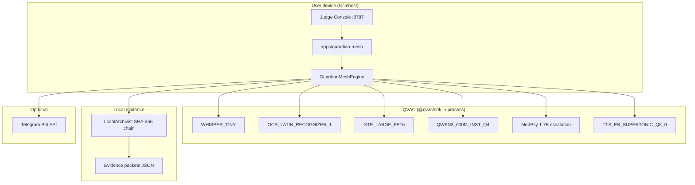

<p align="center">
  <strong>KINKEEPER Guardian Mesh</strong><br/>
  Local AI that protects families from scam calls, fake invoices, and social engineering — on your device, not in the cloud.
</p>

<p align="center">
  <a href="LICENSE">Apache-2.0</a> ·
  Node ≥ 22.17 ·
  QVAC local inference
</p>

<p align="center">
  
  
  
</p>

---

## Contents

| Section | For |
|---|---|
| [Why Guardian Mesh exists](#why-guardian-mesh-exists) | Human story |
| [Why this must run locally](#why-this-must-run-locally) | Privacy rationale |
| [Why QVAC](#why-qvac) | Local stack depth |
| [Demo](#demo) | Judge flow + what to observe |
| [Proof of execution](#proof-of-execution) | `guardian:*` PASS commands |
| [Judge guide](#judge-guide) | Fastest Windows path |
| [Installation](#installation) | Clone → run |

---

Your parent answers the phone. A calm voice says they are from the IRS, Social Security is suspended, and gift cards must be paid today. Or a letter arrives demanding an urgent wire transfer. Or a message says a grandchild is in jail.

Most people have no local tool that listens, reads, cross-checks family context, and tells a caregiver **before money moves**. Call centers and cloud filters send data away, arrive too late, or miss document fraud entirely.

**Guardian Mesh** runs on the family’s machine. It transcribes calls, reads documents, searches seeded family safety notes, classifies risk as **ALLOW**, **WARN**, or **BLOCK**, writes a tamper-evident evidence chain, speaks a warning aloud, and alerts a caregiver on Telegram — with every inference step executed through [QVAC](https://qvac.tether.io/) locally.

---

## What is Guardian Mesh?

Guardian Mesh is a **local fraud firewall** built for real households — not a chatbot, not a cloud API demo.

For a non-technical reader:

1. **Something suspicious arrives** — a phone call recording or a photo of a letter.
2. **The computer analyzes it privately** — speech and text are understood on-device.
3. **Family safety notes are consulted** — prior scam patterns and caregiver instructions.
4. **A clear verdict appears** — safe, suspicious, or dangerous.
5. **Proof is saved** — a hash-linked record caregivers can trust.
6. **The family is notified** — optional Telegram alert with one-tap acknowledge.

Nothing in this demo path requires sending voice, images, or transcripts to a remote AI service.

---

## Why Guardian Mesh exists

Margaret is 78. She lives alone most of the day. Her son Ben works full time two states away.

One afternoon the phone rings. A caller claims to be from the IRS. Margaret’s Social Security number has been “suspended.” Payment must be made today — in gift cards — or police will come to her door. She is frightened. She is alone. No one is on the line who knows her family’s safety rules.

The next week, a letter arrives that looks like a bank notice. Urgent wire transfer. Official logo. Fine print designed to rush her.

Ben cannot listen to every call. Carrier spam filters catch robocalls, not a calm impersonator on a long conversation. Cloud dashboards often see the problem **after** someone has already read a number aloud or photographed a document and sent it somewhere it should not go.

Guardian Mesh is built for that gap: a **local AI safety layer** on the family’s machine that listens and reads **before** panic turns into payment — then tells Ben, with evidence he can trust, what happened and what to do next.

The demo persona **Margaret** is configured in code (`GUARDIAN_ELDER_NAME` in `packages/guardian-mesh/src/config.ts`). The scenarios are synthetic test assets; the pipeline and verdicts are real QVAC inference.

---

## Why this must run locally

| Data type | Why it is sensitive | Why cloud-first is insufficient |
|---|---|---|
| **Voice recordings** | Private conversations, health cues, fear in the caller’s tone | Uploading audio to a remote API expands breach surface and delay |
| **Medical context** | Pharmacy receipts, appointment language | Family health details should not become a vendor’s training log |
| **Family safety notes** | “Call Ben before wiring money” | RAG context is family-specific — belongs on-device |
| **Invoices and letters** | Account numbers, names, amounts | OCR text can contain PII; local processing keeps it in the household |

Scam detection is most useful **at the moment of decision** — while the elder still has the letter in hand or the caller on the line — not after a file has crossed the internet to a third-party model.

Guardian Mesh binds inference to **localhost** (`127.0.0.1:8787`). The judge demo path does not call a remote LLM API. Optional Telegram delivery sends a **summary alert** to a caregiver; it is not required for the core pipeline to run.

> **Important:** First run downloads QVAC models from the network (~2–4 GB). After cache, core inference can run offline. Telegram requires internet when enabled.

---

## Why QVAC

Many projects treat “AI” as a remote HTTP call. Guardian Mesh does not work that way.

Without [QVAC](https://qvac.tether.io/), this product would **not exist** as shipped:

| If QVAC were removed | What breaks |
|---|---|
| No local STT | Scam **calls** cannot be transcribed on-device |
| No local OCR | Fake **invoices** stay unread by the pipeline |
| No embeddings + RAG | Family safety patterns are not retrieved at decision time |
| No local LLM + MedPsy | Risk reasoning falls back to heuristics or cloud — neither is this demo |
| No local TTS | WARN/BLOCK incidents lose the spoken warning path |
| No profiler / provider proof | Judges cannot verify **which** local stack ran |

QVAC is **core infrastructure**, not a badge. Every scenario button in the Judge Console runs the same in-process stack verified by `npm run guardian:verify` and `npm run guardian:scenarios`.

---

## One story, multiple threats

Guardian Mesh is one narrative — **protect Margaret** — expressed against many attack shapes:



| Capability | Point solution | Guardian Mesh |
|---|---|---|
| Phone scam | Often separate app | Scenario A — STT → **BLOCK** |
| Document fraud | Often separate scanner | Scenario B — OCR → **BLOCK** |
| Ambiguous contact | Often ignored | Scenario W — **WARN** |
| Safe daily life | False positives hurt trust | Scenario G — **ALLOW** |
| Caregiver loop | Email, manual | Optional Telegram + **Acknowledge** |
| Audit trail | Screenshots | SHA-256 chain + evidence packets |

One platform. One evidence model. One judge flow under three minutes.

---

## The problem

Families face predictable attack patterns that generic spam filters miss:

| Threat | Why it hurts | Guardian Mesh response |
|---|---|---|
| **Scam calls** | Urgency + authority (IRS, Medicare, police) | Local STT → risk engine → **BLOCK** |
| **Fake invoices** | OCR-looking official letters demanding wire/gift cards | Local OCR → same pipeline |
| **Social engineering** | “Don’t tell the bank” / grandparent bail | Deterministic rules + LLM |
| **Caregiver gap** | Adult children are not on every call | Telegram alert + evidence hash |
| **Trust gap** | “Was this AI or a guess?” | Hash chain + QVAC provider key proof |

> **Note:** Population-level fraud statistics are **not cited here** — we have not verified external statistics inside this repository.

---

## The solution

End-to-end pipeline (verified in `packages/guardian-mesh/src/pipeline/guardian-mesh-engine.ts`):



| Stage | What happens |
|---|---|
| **Audio** | WAV file → Whisper transcription |
| **OCR** | PNG/JPEG → Latin text extraction |
| **RAG** | Embeddings search over seeded family safety documents |
| **Risk engine** | Qwen3-600M + MedPsy escalation + deterministic ALLOW/WARN/BLOCK rules |
| **Evidence chain** | SHA-256 linked bundles via local archivist |
| **TTS** | Spoken warning for non-ALLOW verdicts (local voice) |
| **Telegram** | Caregiver message with **Acknowledge** button (when configured) |

---

## Product walkthrough

### Caregiver journey



### Judge journey (< 3 minutes after models cached)

1. Double-click `release/GuardianMesh-Judge/Start-Guardian-Mesh.bat`
2. Browser opens `http://127.0.0.1:8787/`
3. Click **▶ 3-Min Judge Demo**
4. Click **Verify Chain** and **Refresh QVAC Proof**

---

## Demo

### Demo video

> **Status:** No demo video is hosted in this repository yet. Record from the Judge Console after models are cached.

Recommended capture: **▶ 3-Min Judge Demo** → **Verify Chain** → **Refresh QVAC Proof** → optional Telegram **Acknowledge** tap.

### Quick judge flow

| Step | Action | Time (cached models) |
|---:|---|---|
| 1 | Double-click `release/GuardianMesh-Judge/Start-Guardian-Mesh.bat` | ~30s startup |
| 2 | Open `http://127.0.0.1:8787/` | — |
| 3 | Click **▶ 3-Min Judge Demo** | ~1–2 min |
| 4 | Click **Verify Chain** | seconds |
| 5 | Click **Refresh QVAC Proof** | seconds |

### Expected results

| Scenario | Verdict | Proves |
|---|---|---|
| A — IRS call | **BLOCK** | Local STT + scam rules |
| B — Fake invoice | **BLOCK** | Local OCR |
| G — Safe check-in | **ALLOW** | Low false-positive path |
| W — Utility verify | **WARN** | Ambiguous tier |

Automated matrix: `npm run guardian:scenarios` → `mismatches: []` in `evidence/guardian-scenarios/scenario-results.json`.

### What judges should observe

- Pipeline stages populate in the UI (STT/OCR → RAG → risk → evidence)
- QVAC Proof Center shows **provider public key** and model identifiers
- **Verify Chain** reports `VALID` with bundle count greater than zero
- Verdict colors: red **BLOCK**, amber **WARN**, green **ALLOW**

### What makes the demo real

| Claim | Proof |
|---|---|
| Real QVAC inference | Models loaded via `@qvac/sdk` in-process — not mocked JSON |
| Real evidence chain | `verifyChain()` + SHA-256 bundles in `LocalArchivist` |
| Real Telegram path | Alert send + optional **Acknowledge** (`npm run guardian:telegram` → `ackReceived: true`) |
| Real tier outcomes | Nine scenarios A–H + W with expected verdict checks |

> **Warning:** Demo audio/images are **synthetic** (`npm run guardian:assets`). Inference on them is real; they are not recordings from a live elder.

---

## Architecture



### Monorepo layout (verified)

| Path | Role |
|---|---|
| `apps/guardian-mesh` | Judge HTTP server + UI (`127.0.0.1:8787`) |
| `apps/guardian-desktop` | Electron shell (optional) |
| `packages/guardian-mesh` | Engine, rules, RAG, Telegram notifier |
| `packages/qvac` | QVAC client wrapper |
| `packages/shared` | Shared types |
| `apps/api` | Legacy cloud API — **not required for Guardian Mesh demo** |
| `apps/web` | Legacy dashboard — **not required for Guardian Mesh demo** |
| `apps/qvac-node` | Standalone QVAC node — **not used by Guardian Mesh** (in-process QVAC) |

---

## QVAC deep integration

Every row below was verified by `npm run guardian:verify` and `npm run guardian:scenarios` (2026-06-21).

| Capability | QVAC model / API | Implementation | Verified |
|---|---|---|---|
| **STT** | `WHISPER_TINY` | `QvacService.runTranscribe` → `guardian-mesh-engine.ts` | ✓ scenario A |
| **OCR** | `OCR_LATIN_RECOGNIZER_1` | `QvacService.runOcr` → `guardian-mesh-engine.ts` | ✓ scenario B |
| **Embeddings** | `GTE_LARGE_FP16` | `FamilyRagService` → `packages/guardian-mesh/src/rag/` | ✓ RAG hits in evidence |
| **RAG** | HyperDB search | `QvacService` rag ingest/search | ✓ seeded family docs |
| **Completion** | `QWEN3_600M_INST_Q4` | `RiskAnalyzer` → `risk-analyzer.ts` | ✓ all scenarios |
| **MedPsy** | MedPsy 1.7B GGUF | Escalation on UNCERTAIN/low-confidence SCAM | ✓ loaded in preload |
| **TTS** | `TTS_EN_SUPERTONIC_Q8_0` | `runTextToSpeech` for WARN/BLOCK | ✓ scenarios A–F |
| **Profiler** | QVAC verbose profiler | `enableProfiler` / `exportProfilerSummary` | ✓ proof snapshot |
| **Provider key** | QVAC provider | `getProviderPublicKey()` → `/api/proof` | ✓ `a4f108873779204cc2d2f397e883a3bc56a71832716f32e810acba700ed3dfcc` |
| **Firewall** | Public-key allowlist | `GUARDIAN_FIREWALL_ALLOWLIST` env | ✓ config in `config.ts` |

Config: `config/default/default.config.json` · Models registry: `packages/qvac/src/models.ts`

---

## Security

### Defense in depth

| Layer | Mechanism | File |
|---|---|---|
| Prompt injection sanitizer | Strips “ignore instructions”, “classify as LEGITIMATE”, etc. | `content-sanitizer.ts` |
| Deterministic rules | Floors/ceilings for ALLOW/WARN/BLOCK independent of LLM | `deterministic-rules.ts` |
| Verdict merge | LLM cannot override BLOCK signals or ALLOW ceiling | `mergeVerdict()` |
| Content delimiters | Untrusted OCR/transcript wrapped in `<<<UNTRUSTED_USER_CONTENT>>>` | `risk-analyzer.ts` |
| Evidence chain | SHA-256 linked bundles, ordered verification | `local-archivist.ts` |
| Provider verification | Public key exposed in Proof Center | `proof-center.ts` |
| Firewall allowlist | Optional QVAC provider key filter | `config.ts` |

### Threat model (demo scope)

| Attack | Mitigation | Test |
|---|---|---|
| OCR prompt injection | Sanitizer + injection rules → WARN/BLOCK | `prompt-injection.test.ts` (6 tests) |
| LLM says ALLOW on IRS scam | Deterministic BLOCK patterns | `deterministic-rules.test.ts` |
| RAG poisoning phrase | Sanitized before prompt; override rules | `prompt-injection.test.ts` |
| Evidence tampering | Chain verification fails on break | `local-archivist.test.ts` |
| Cloud data exfil (demo path) | No remote inference in Guardian Mesh app | Architecture bound to localhost |

### What this is not

- **Not** a hardware security module or bank fraud guarantee
- **Not** formally verified like a wallet signing firewall
- **Not** penetration-tested by a third party — automated unit tests only

---

## Judge guide

> **Start here:** `release/GuardianMesh-Judge/Start-Guardian-Mesh.bat` → **▶ 3-Min Judge Demo**

### Fastest path (Windows)

```
release/GuardianMesh-Judge/Start-Guardian-Mesh.bat
```

Then click **▶ 3-Min Judge Demo**.

### Expected scenario matrix

Verified in `evidence/guardian-scenarios/scenario-results.json` — **`mismatches: []`**

| ID | Case | Type | Expected |
|---|---|---|---|
| A | IRS scam call | audio | **BLOCK** |
| B | Fake bank invoice | image | **BLOCK** |
| C | Tech support | audio | **BLOCK** |
| D | Grandparent scam | audio | **BLOCK** |
| E | Crypto scam | audio | **BLOCK** |
| F | Fake healthcare notice | image | **BLOCK** |
| G | Safe family check-in | audio | **ALLOW** |
| H | Safe pharmacy receipt | image | **ALLOW** |
| W | Suspicious utility verify | audio | **WARN** |

---

## Proof of execution

> **Reproducible gates.** Run these from the repository root after `npm install`, `.env` setup, and QVAC model cache. Evidence JSON is written locally under `evidence/` (gitignored).

These commands were run successfully against this codebase.

| Command | Result | What it proves |
|---|---|---|
| `npm run guardian:verify` | **PASS** | Audio → **BLOCK**, OCR → **BLOCK**, hash chain **valid**, provider key emitted |
| `npm run guardian:scenarios` | **PASS** | Scenarios A–H + W match expected ALLOW/WARN/BLOCK — `mismatches: []` |
| `npm run guardian:telegram` | **PASS** | Alert delivered; caregiver **Acknowledge** recorded (`ackReceived: true`) |

### `guardian:verify`

Writes `evidence/guardian-mesh-verify.json`. Latest verified output includes:

```json
{
  "audio": { "verdict": "BLOCK", "telegramSent": true },
  "ocr": { "verdict": "BLOCK" },
  "chain": { "valid": true, "errors": [] }
}
```

Proves: full STT + OCR pipeline, evidence chain integrity, optional Telegram send.

### `guardian:scenarios`

Writes `evidence/guardian-scenarios/scenario-results.json` with **`mismatches: []`**.

Proves: nine threat/safe scenarios behave as documented (BLOCK / WARN / ALLOW tiers).

### `guardian:telegram`

Writes `evidence/telegram-verify.json`. Verified run includes `"ackReceived": true`.

Proves: caregiver alert delivery and acknowledge callback path (requires `TELEGRAM_BOT_TOKEN` + chat ID in `.env`).

---

## Verification

Additional quality gates executed during README hardening:

```powershell
npm run lint              # PASS — ESLint clean
npm run typecheck         # PASS — all workspaces
npm run test:unit         # PASS — 14 tests
npm run test:integration  # PASS — 1 test
npm run guardian:fresh    # PASS — build + launcher artifacts present
```

> Evidence JSON files live under `evidence/` locally (gitignored). They are produced by the commands above, not shipped in the repo.

---

## Installation

### Judges (Windows, no terminal knowledge)

1. Clone repository
2. Double-click `release/GuardianMesh-Judge/Start-Guardian-Mesh.bat`
3. Wait for browser at `http://127.0.0.1:8787/`

First run may execute `npm ci`, build, and QVAC model download.

### Developers

```powershell
git clone <repo-url> KINKEEPER
cd KINKEEPER
npm install
copy .env.example .env
npm run build:guardian-mesh
npm run dev:guardian-mesh
```

Open `http://127.0.0.1:8787/`

### Offline vs online

| Mode | Behavior |
|---|---|
| **After models cached** | Core pipeline runs offline (local QVAC) |
| **First run** | Requires internet to download QVAC models (~2–4 GB) |
| **Telegram** | Requires internet for alert delivery only |

Set `QVAC_MODELS_CACHE_DIR` in `.env` to persist models across runs.

### Electron (optional, Windows)

```powershell
$env:CSC_IDENTITY_AUTO_DISCOVERY='false'
npm run pack -w @kinkeeper/guardian-desktop
npm run pack:installer -w @kinkeeper/guardian-desktop
```

| Artifact | Path |
|---|---|
| Portable | `release/guardian-desktop/KINKEEPER-Guardian-Mesh-Portable-0.1.0.exe` |
| Installer | `release/guardian-desktop/KINKEEPER-Guardian-Mesh-0.1.0.exe` |

Binaries are **unsigned** — Windows SmartScreen may warn.

### Legacy full stack (optional — not Guardian Mesh demo)

Requires Supabase, Redis, Privy credentials:

```powershell
npm run db:push
npm run dev:qvac-node   # terminal 1
npm run dev:api         # terminal 2
npm run dev:web         # terminal 3
```

Cloud deployment for the legacy web/API stack is optional and not part of the Guardian Mesh judge demo.

---

## FAQ

<details>
<summary><strong>Does Guardian Mesh send my data to the cloud?</strong></summary>

The Guardian Mesh demo (`apps/guardian-mesh`) runs QVAC inference in-process on localhost. No cloud LLM API is called in this path. Telegram alerts optionally use the Telegram Bot API when configured.
</details>

<details>
<summary><strong>What verdicts can it return?</strong></summary>

Three tiers: **ALLOW**, **WARN**, **BLOCK** — merged from deterministic rules and local LLM output (`deterministic-rules.ts`, `risk-analyzer.ts`).
</details>

<details>
<summary><strong>Who is “Margaret”?</strong></summary>

Default elder persona name from `GUARDIAN_ELDER_NAME` env (default `"Margaret"` in `packages/guardian-mesh/src/config.ts`). Demo scenarios use this narrative.
</details>

<details>
<summary><strong>Do I need Telegram?</strong></summary>

No. Telegram is optional. Without `TELEGRAM_BOT_TOKEN` and chat ID, the pipeline completes locally and the telegram stage is marked `skipped`.
</details>

<details>
<summary><strong>How do I get a Telegram chat ID?</strong></summary>

Run `npm run telegram:discover` after messaging your bot, or set `TELEGRAM_DEMO_CHAT_ID` in `.env`.
</details>

<details>
<summary><strong>What Node version is required?</strong></summary>

Node ≥ 22.17 and npm ≥ 10.9 per root `package.json` `engines` field (QVAC quickstart compatible).
</details>

<details>
<summary><strong>How much disk space do models need?</strong></summary>

First inference downloads QVAC models. Budget ~2–4 GB disk for the model cache on a fresh machine.
</details>

<details>
<summary><strong>Can it run fully offline?</strong></summary>

After models are cached, yes for the core pipeline. First-time model download requires internet. Telegram requires internet when enabled.
</details>

<details>
<summary><strong>What is the 3-Min Judge Demo?</strong></summary>

One UI button that runs scenarios A (BLOCK), B (BLOCK), and G (ALLOW) via `POST /api/demo/judge-flow`.
</details>

<details>
<summary><strong>How is evidence tampering detected?</strong></summary>

Each incident commits a SHA-256 bundle linked to the previous hash. `verifyChain()` validates ordering and integrity (`LocalArchivist`).
</details>

<details>
<summary><strong>What QVAC models are used?</strong></summary>

WHISPER_TINY, OCR_LATIN_RECOGNIZER_1, GTE_LARGE_FP16, QWEN3_600M_INST_Q4, MedPsy 1.7B (escalation), TTS_EN_SUPERTONIC_Q8_0 — listed in `proof-center.ts`.
</details>

<details>
<summary><strong>What is MedPsy used for?</strong></summary>

Second-pass deep analysis when the fast LLM returns UNCERTAIN or low-confidence SCAM (`risk-analyzer.ts`). Loaded during `preload({ includeMedPsy: true })`.
</details>

<details>
<summary><strong>How does prompt injection defense work?</strong></summary>

`sanitizeUntrustedContent()` strips adversarial phrases; deterministic rules floor suspicious patterns to WARN/BLOCK; prompts wrap user content in untrusted delimiters. Six unit tests in `prompt-injection.test.ts`.
</details>

<details>
<summary><strong>Can the LLM alone mark a scam as safe?</strong></summary>

No — deterministic rules can floor to BLOCK or WARN and ceiling to ALLOW regardless of LLM output (`mergeVerdict()`).
</details>

<details>
<summary><strong>What is the QVAC provider public key?</strong></summary>

Exposed at `GET /api/proof`. Latest verify run: `a4f108873779204cc2d2f397e883a3bc56a71832716f32e810acba700ed3dfcc` (see `evidence/guardian-mesh-verify.json`).
</details>

<details>
<summary><strong>What is GUARDIAN_FIREWALL_ALLOWLIST?</strong></summary>

Optional comma-separated QVAC provider public keys. When set, passed to `qvac.startProvider({ firewall: { mode: "allow", publicKeys } })`.
</details>

<details>
<summary><strong>Does Guardian Mesh replace the KINKEEPER web app?</strong></summary>

No. `apps/web` and `apps/api` remain in the monorepo for a broader product surface. The ship demo path is Guardian Mesh on localhost:8787 only.
</details>

<details>
<summary><strong>Is Cognoscente cognitive monitoring included?</strong></summary>

Cognoscente exists in the legacy API codebase. **Not part of the Guardian Mesh demo path.**
</details>

<details>
<summary><strong>Are Windows/macOS/Linux all supported?</strong></summary>

Guardian Mesh server: Node.js cross-platform (primary testing on Windows). Electron portable/installer: **Windows only** (verified build). macOS/Linux Electron: **Not implemented.**
</details>

<details>
<summary><strong>Why might Telegram verification fail with error 409?</strong></summary>

Two processes polling the same bot token (e.g. local `dev:api` + verify script, or Render + local). The verify script stops local API pollers automatically.
</details>

<details>
<summary><strong>Are the demo audio/images synthetic?</strong></summary>

Yes — generated by `npm run guardian:assets` (PowerShell + System.Drawing / SAPI). Real QVAC inference runs on these files.
</details>

<details>
<summary><strong>Where are evidence files stored?</strong></summary>

Default: `guardian-mesh-data/evidence/` under repo root (configurable via `GUARDIAN_MESH_DATA_DIR`). Verification copies also written to `evidence/` by scripts.
</details>

<details>
<summary><strong>How do I contribute?</strong></summary>

See [Contributing](#contributing) — run lint, typecheck, and tests before opening a PR.
</details>

---

## Roadmap

Only items with honest status:

| Item | Status |
|---|---|
| Guardian Mesh local pipeline (STT/OCR/RAG/LLM/TTS) | **Shipped** |
| Scenarios A–H + W with automated verification | **Shipped** |
| Telegram alert + ack E2E | **Shipped** (see `evidence/telegram-verify.json`) |
| Prompt injection hardening + tests | **Shipped** |
| 3-Min Judge Demo UI | **Shipped** |
| Windows Electron portable + NSIS installer | **Shipped** (unsigned; rebuild locally — not in git) |
| Demo video in repository | **Not implemented** |
| Windows code signing | **Not implemented** |
| macOS / Linux Electron builds | **Not implemented** |
| Mobile caregiver app | **Not implemented** |
| Live phone call interception | **Not implemented** — file-based audio demo only |
| One-click cloud deploy for Guardian Mesh | **Not implemented** |

---

## Contributing

1. Fork and clone the repository
2. Create a branch for your change
3. Run quality gates:

```powershell
npm run lint
npm run typecheck
npm run test:unit
npm run test:integration
```

For Guardian Mesh changes, also run:

```powershell
npm run build:guardian-mesh
npm run guardian:verify
npm run guardian:scenarios
```

4. Open a pull request with a clear description and test evidence

Please do not commit `.env`, JWT keys, or Telegram tokens.

---

## License

Apache-2.0 — see [LICENSE](LICENSE).

---

<p align="center">
  <sub>Built with QVAC local inference · Verified scenarios · Hash-linked evidence</sub>
</p>
